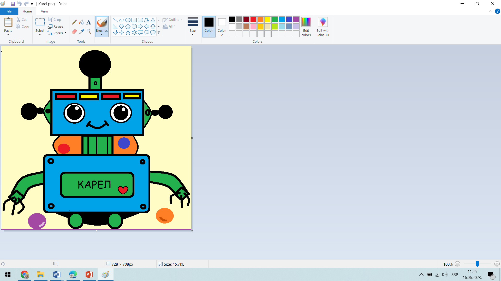

Bevezető tevékenységek
=================

.. infonote::

 Ebben a leckében felidézünk néhány korábban tanult dolgot:

 - hogyan kell rajzolni a Paintben,
 - hogyan lehet szöveget hozzáadni egy képhez,
 - hogyan kell szöveget bevinni egy dokumentumba,
 - hogyan kell a dokumentumokat elmenteni.

Mielőtt elkezdenéd a munkát, emlékezz vissza arra, hogy mennyi mindent meg tudsz már megcsinálni a Digitális világban! 
A harmadik osztályos digitális tankönyvet továbbra is `ugyanazon a címen <https://petlja.org/kurs/8533/1/>`_ találhatod meg.

Miközben átlapozod a tavalyi tankönyvet, végezz el néhány gyakorlatot is – készíts szöveges dokumentumot, majd mentsd azt el, készíts digitális rajzot, adj a képhez szöveget, keress rá az interneten egy fogalomra, stb. A gyakorlati feladatok a Digitális világban sokkal nagyobb jelentőséggel bírnak, mint a száraz elmélettel való ismerkedés. 

Bevezető gyakorlat 1
``````````````

Az előző évek során megtanultad, hogyan készíts digitális rajzokat a *Paint* segítségével. Ismételjük át, hogyan kell ezt csinálni!

A feladat a következő: 

.. questionnote:: 

 Нацртај робота Карела онако како га ти замишљаш. На слику додај и његово име. Сачувај слику као *Karel.jpg* у фасцикли *Pictures*.


	
.. questionnote:: 

 Овако је слику нацртао Марко. По чему се твоја идеја разликује од његове?
 
 
Уводна вежба 2
``````````````

Једна од првих ствари која те очекује јесте уређивање текста. 

Да би могао добро да увежбаш неке од ових техника, потребно је да имаш унапред припремљен текст.

Покрени Ворд (*Microsoft Word*) и отвори нови, празан документ. 

Унеси у документ текст о роботу Карелу који се налази на слици испод.

.. image:: ../../_images/tekst.png
	:width: 800
	:align: center
	
Сачувај документ у фасцикли *Documents* под називом *Karel i programiranje.docx*.

|

