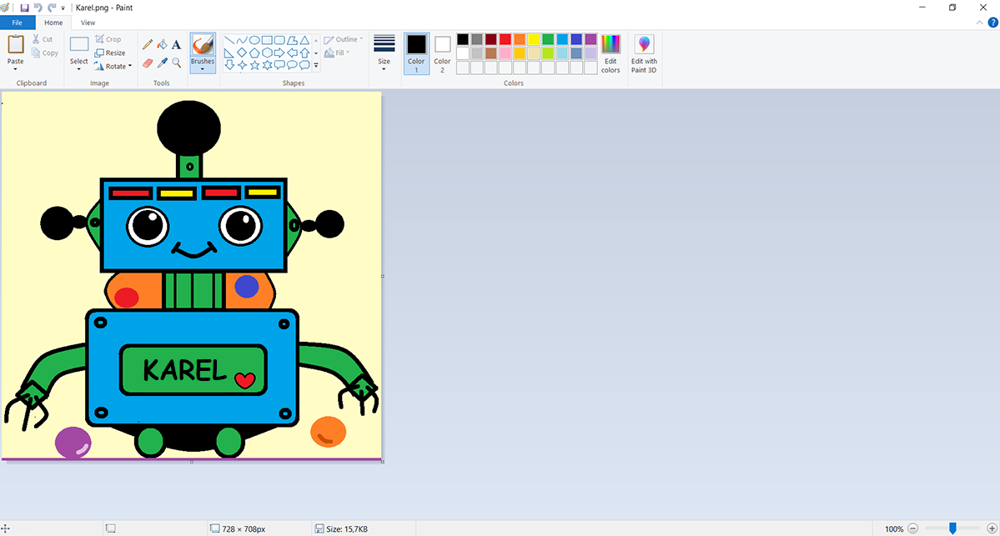
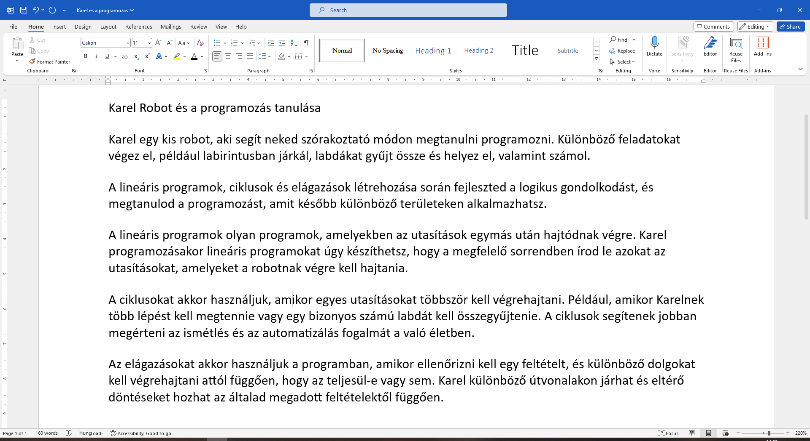

Bevezető tevékenységek
=======================

.. infonote::

 Ebben a leckében felidézünk néhány korábban tanult dolgot:

 - hogyan kell rajzolni a Paintben,
 - hogyan lehet szöveget hozzáadni egy képhez,
 - hogyan kell szöveget bevinni egy dokumentumba,
 - hogyan kell a dokumentumokat elmenteni.

Mielőtt elkezdenéd a munkát, emlékezz vissza arra, hogy mennyi mindent meg tudsz már megcsinálni a Digitális világban! 
A harmadik osztályos digitális tankönyvet továbbra is `ugyanazon a címen <https://petlja.org/kurs/8533/1/>`_ találhatod meg.

Miközben átlapozod a tavalyi tankönyvet, végezz el néhány gyakorlatot is – készíts szöveges dokumentumot, majd mentsd azt el, készíts digitális rajzot, adj a képhez szöveget, keress rá az interneten egy fogalomra, stb. A gyakorlati feladatok a Digitális világban sokkal nagyobb jelentőséggel bírnak, mint a száraz elmélettel való ismerkedés. 

Bevezető gyakorlat 1
````````````````````

Az előző évek során megtanultad, hogyan készíts digitális rajzokat a *Paint* segítségével. Ismételjük át, hogyan kell ezt csinálni!

A feladat a következő: 

.. questionnote:: 

 Rajzold le Karel robotot úgy, ahogy te elképzeled. Add hozzá a nevét is a képhez. Mentsd el a képet *Karel.jpg* néven a *Pictures* mappába.


	
.. questionnote:: 

 Márk így rajzolta a képet. Miben különbözik a te ötleted az övétől?
 
 
Bevezető gyakorlat 2
````````````````````

Az első dolgok egyike, ami rád vár, a szöveg szerkesztése.

Ahhoz, hogy ezt jól begyakorolhasd, előre elkészített szövegre lesz szükséged.

Indítsd el a Wordöt (*Microsoft Word*), és nyiss meg egy új, üres dokumentumot.

Vidd be a dokumentumba a Karel robotról szóló szöveget, amely az alábbi képen található.


	
Mentsd el a dokumentumot a *Documents* mappába *Karel es a programozas.docx* néven.

|

