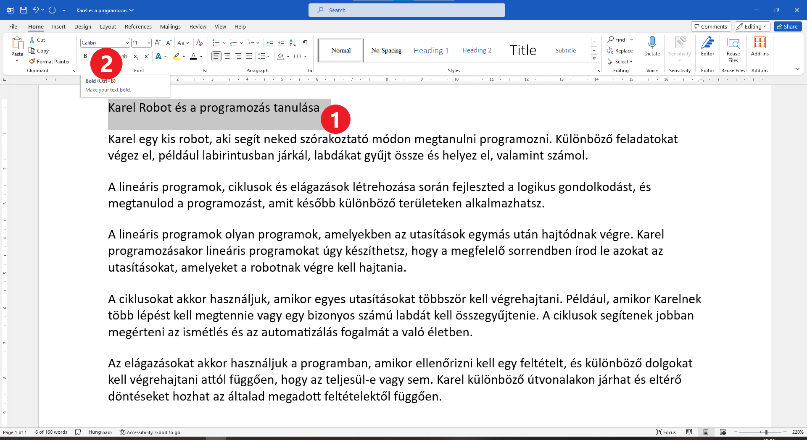

Félkövér betűs szöveg
=====================

.. infonote::

 Ebben a leckében megtanulod, hogy miként lehet...

 - félkövér, dőlt betűs és aláhúzott szöveget létrehozni, 
 - megváltoztatni a szöveg méretét és színét,
 - kivágni és másolni a szöveget, illetve a kivágott/másolt szöveget beilleszteni a megfelelő helyre. 

.. questionnote::

 Lapozz bele bármelyik tankönyvbe, amit használsz. Minden szöveg ugyanúgy van írva? 
 Észrevettél olyan szavakat, amelyek vastag betűkkel vannak írva? 
 Miért emelték ki pont ezeket a szavakat? Mit akartak ezzel elérni a szerzők?
 
Један од начина да се истакне нека значајна реч у тексту (или део текста) јесте да се напише **подебљаним словима**. 
Можеш чути да неко каже и „масним словима“. На овај начин текст постаје прегледнији, а оно што је у њему важно лакше 
се запамти. 

Подебљавање делова текста увежбаћеш на конкретном примеру. 

Пронађи и отвори *Karel i programiranje.docx*, документ који си претходно направио. 

Хајде да подебљамо слова којима је написан наслов текста. Селектуј наслов (пређи мишем преко наслова држећи притиснут 
леви тастер) (1).

Кликни на дугменце са ознаком **B** (2). Да ли си успешно променио дебљину слова?
Када приближиш миша овом дугменцету, појавиће се и оквир са текстом **Ctrl + B**. То је комбинација тастера помоћу које 
можеш да урадиш исту радњу – да подебљаш изабран текст. 

.. infonote::

 За подебљавање текста помоћу тастатуре користи се комбинација тастера **Ctrl + B**.
 
Селектуј мишем речи *Линијски програми*, којима почиње трећи пасус, и притисни на тастатури тастер **Ctrl**. 
Затим (и даље држећи притиснуто **Ctrl**) притисни и слово **B** (Б ћирилицом). Да ли си успешно подебљао слова ове речи? 

.. questionnote::

 Који ти је начин лакши – преко тастатуре или кликом на дугменце?

.. image:: ../../_images/bold2.png
	:width: 800
	:align: center

.. questionnote::

 Још једном пажљиво прочитај текст. О чему говори? Који су појмови објашњени? Подебљај кључне речи. 
 
 Које си речи изабрао и због чега?
 

