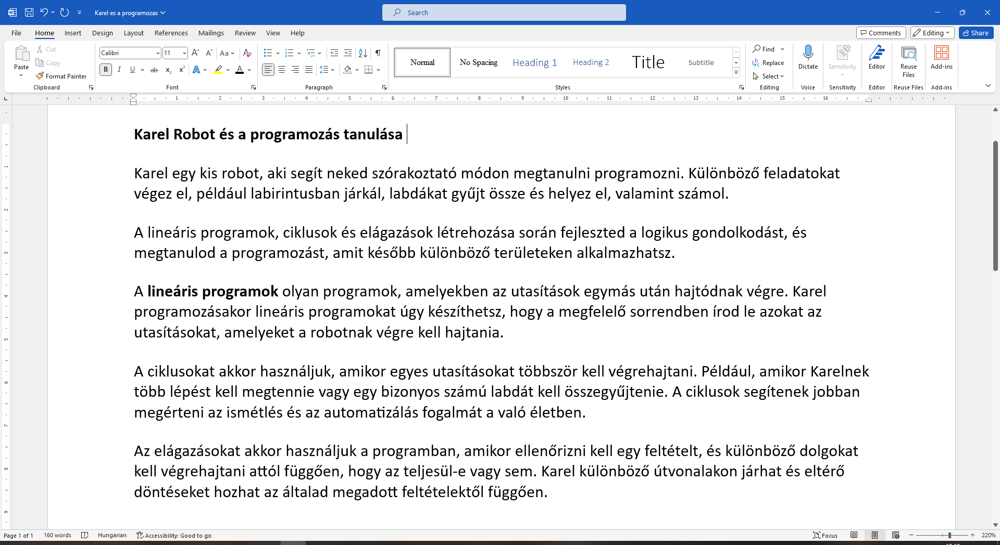

Félkövér betűs szöveg
=====================

.. infonote::

 Ebben a leckében megtanulod, hogy miként lehet...

 - félkövér, dőlt betűs és aláhúzott szöveget létrehozni, 
 - megváltoztatni a szöveg méretét és színét,
 - kivágni és másolni a szöveget, illetve a kivágott/másolt szöveget beilleszteni a megfelelő helyre. 

.. questionnote::

 Lapozz bele bármelyik tankönyvbe, amit használsz. Minden szöveg ugyanúgy van írva? 
 Észrevettél olyan szavakat, amelyek vastag betűkkel vannak írva? 
 Miért emelték ki pont ezeket a szavakat? Mit akartak ezzel elérni a szerzők?
 
Az egyik módja annak, hogy kiemeljünk egy fontos szót a szövegben (vagy a szöveg egy részét), az, hogy **vastag betűkkel** írjuk.
Az ilyen betűket „félkövér betűknek” is nevezik. Ezzel a szöveg áttekinthetőbbé válik, és így segít a fontos dolgokat könnyebben megjegyezni.

A szövegrészek vastagítását egy konkrét példán keresztül fogjuk neked bemutatni.

Keresd meg és nyisd meg a *Karel es a programozas.docx* dokumentumot, amit már korábban elkészítettél.

Kezdjük azzal, hogy megvastagítjuk a szöveg címének betűit. Jelöld ki a címet (húzd végig az egeret a címen, miközben nyomva tartod a bal gombot) (1).

.. image:: ../../_images/bold1.png
	:width: 800
	:align: center

Kattints a **B** jelű gombra (2). Sikerült megváltoztatni a betűk vastagságát?
Amikor az egeret a gomb fölé viszed, megjelenik egy szövegdoboz **Ctrl + B** felirattal. Ez a billentyűkombináció ugyanezt a műveletet végzi el – azaz megvastagítja a kijelölt szöveget.

.. infonote::

 Ha félkövérré szeretnéd alakítani a szöveget a billentyűzet segítségével, használd a **Ctrl + B** billentyűkombinációt.
 
Jelöld ki az egérrel a *Lineáris programok* szavakat, amelyekkel a harmadik bekezdés kezdődik, és nyomd meg a billentyűzeten a **Ctrl** gombot.
Ezután (továbbra is nyomva tartva a **Ctrl**-t) nyomd meg a B betűt. Sikerült megvastagítanod ezeknek a szavaknak a betűit?

.. questionnote::

 Melyik módszer könnyebb számodra – a billentyűzet használata vagy a gombra kattintás?

.. questionnote::

 Olvasd el újra figyelmesen a szöveget. Miről szól? Mely fogalmak vannak elmagyarázva? Emeld ki a kulcsszavakat félkövér betűkkel. 
 
 Mely szavakat választottad, és miért?
 

