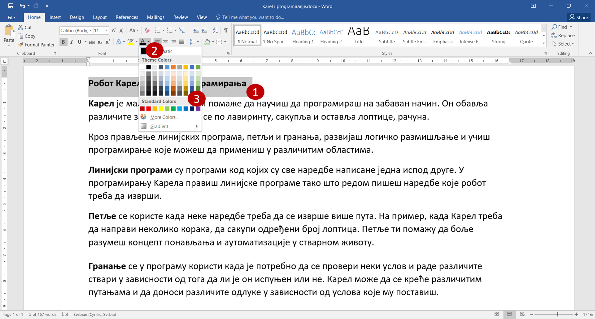
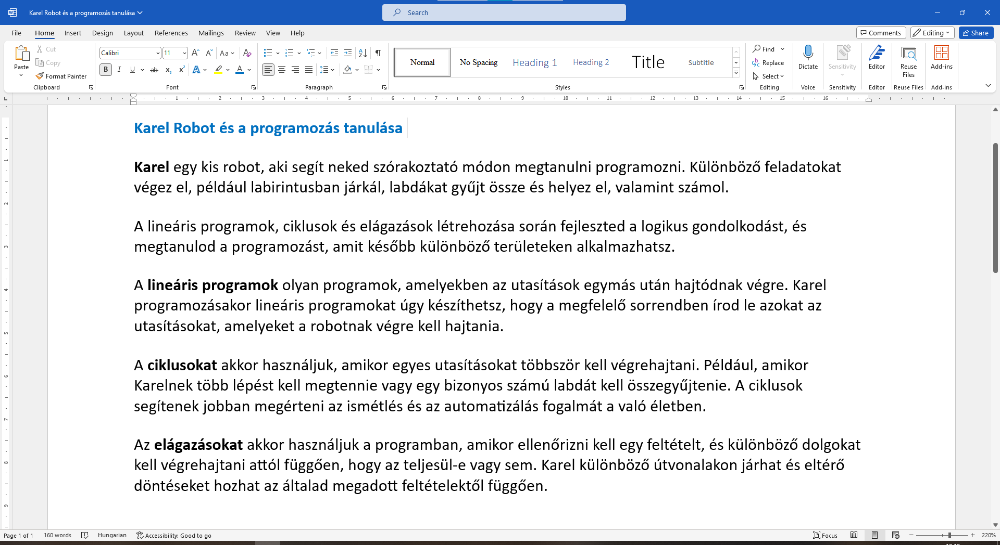
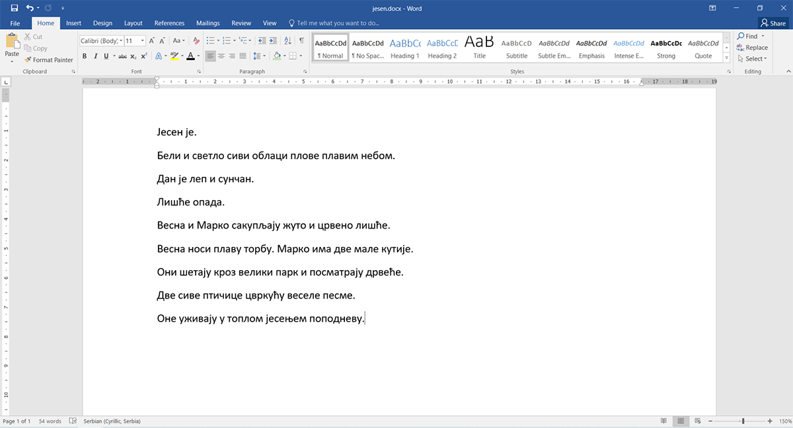

A szöveg színének megváltoztatása
=================================

Ahogy papírra írás közben néha színes ceruzákat vagy filctollakat is használsz, úgy a Wordben is megváltoztathatod a betűk színét.

.. suggestionnote::

 Előfordul, hogy egy dokumentum teljes szövegét módosítanod kell. Ha ki akarod jelölni a teljes szöveget, ezt egyszerűen megteheted a **Ctrl + A** billentyűkombinációval.
 

Változtasd meg a cím színét. Hogyan lehet ezt elérni? Kövesd a fenti képet.

Ahogy az előző feladatban is, jelöld ki a címet (1).

Kattints a képen jelölt **A betűs** gomb jobb oldalán levő **nyílra** (2). Ennek hatására megnyílik egy színpaletta (3).
Ha rákattintasz valamelyik négyzetre, a kijelölt szöveg betűi annak a színét veszik fel.

Az eredmény a következő:
 

	
A cím az általad választott színnel, jelen esetben kékkel lett kiírva. Változtasd meg a szöveg további részeinek színét is.

.. questionnote::

 Gondold át, milyen helyzetekben indokolt ugyanazt a szöveget félkövérré és színessé is változtatni? Mi történik, ha ezt szükségtelenül tesszük meg –  
 ugyanolyan olvasható lesz a szöveg? Nézd meg a dokumentumodat a változtatások után. Áttekinthetőbb lett így?

Annak érdekében, hogy minél jobban begyakorold a bemutatott eljárásokat, bátran próbálj ki különböző lehetőségeket!

.. suggestionnote::

 Emlékeztetünk, hogy mindig visszaléphetsz egy vagy több lépéssel! A legegyszerűbb módja ennek az,  
 ha rákattintasz a nyílra vagy a gombra, amely az alábbi képen látható (1).
 
.. image:: ../../_images/korak_nazad.png
	:width: 800
	:align: center

|
	
Као што подебљавање текста можеш да урадиш преко тастатуре тако за враћање корак уназад можеш да користиш 
комбинацију **Ctrl + Z**. 

Овај текст ћемо користити и касније. Сачувај измене и затвори га.

.. infonote::

 За враћање корак уназад користи се комбинација тастера **Ctrl + Z**.
 
Хајде да урадимо још једну кратку вежбу! На часовима српског језика учио си о врстама речи.

Отвори нови документ и упиши реченице са слике испод. 

Сада промени боју речи на следећи начин:

- **именице** (речи које означавају имена бића, предмета и појава) означи **црвеном** бојом,
- **глаголе** (речи које означавају радњу, стање и збивање) означи **зеленом** бојом,
- **придеве** (речи које стоје уз именицу и ближе је одређују) означи **плавом** бојом,
- **заменице** (речи које упућују на бића, предмете и особине) означи **сивом** бојом,
- **бројеве** (речи које одређују колико тачно има нечега) означи **жутом** бојом.

