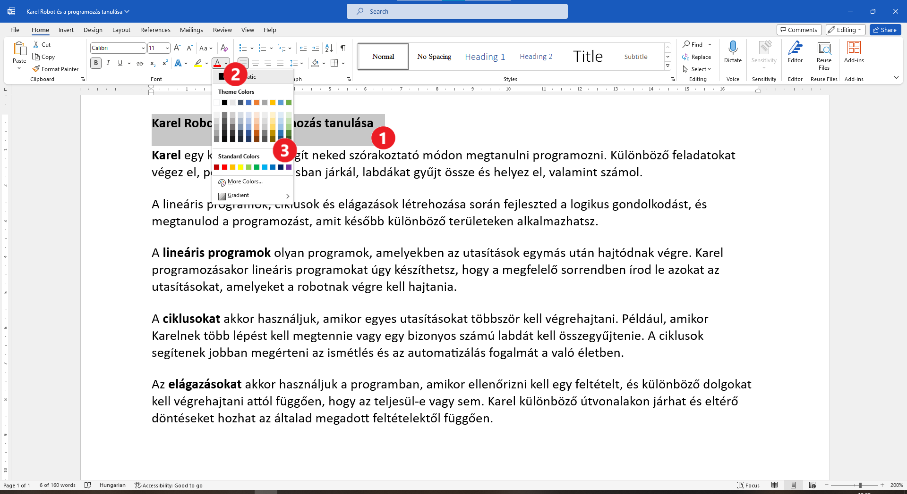
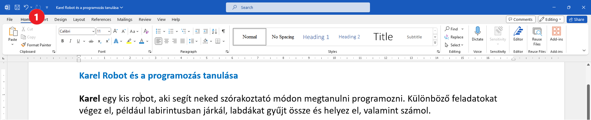

A szöveg színének megváltoztatása
=================================

Ahogy papírra írás közben néha színes ceruzákat vagy filctollakat is használsz, úgy a Wordben is megváltoztathatod a betűk színét.

.. suggestionnote::

 Előfordul, hogy egy dokumentum teljes szövegét módosítanod kell. Ha ki akarod jelölni a teljes szöveget, ezt egyszerűen megteheted a **Ctrl + A** billentyűkombinációval.
 

Változtasd meg a cím színét! Hogyan lehet ezt elérni? Kövesd a fenti képet!

Ahogy az előző feladatban is, jelöld ki a címet (1)!

Kattints a képen jelölt **A betűs** gomb jobb oldalán levő **nyílra** (2)! Ennek hatására megnyílik egy színpaletta (3).
Ha rákattintasz valamelyik négyzetre, a kijelölt szöveg betűi felveszik annak a színét.

Az eredmény a következő:
 

	
A cím az általad választott színnel, jelen esetben kékkel lett kiírva. Változtasd meg a szöveg további részeinek színét is!

.. questionnote::

 Gondold át, milyen helyzetekben indokolt ugyanazt a szöveget félkövérré és színessé is változtatni! Mi történik, ha ezt szükségtelenül tesszük meg? –  
 Ugyanolyannyira olvasható lesz a szöveg? Nézd meg a dokumentumodat a változtatások után! Áttekinthetőbb lett így?

Annak érdekében, hogy minél jobban begyakorold a bemutatott eljárásokat, bátran próbálj ki különböző lehetőségeket!

.. suggestionnote::

 Emlékeztetünk, hogy mindig visszaléphetsz egy vagy több lépéssel! A legegyszerűbb módja ennek az,  
 ha rákattintasz a nyílra vagy a gombra, amely az alábbi képen látható (1).
 

|
	
Ahogy a szöveg félkövérré tételét elvégezheted a billentyűzettel, úgy a visszalépést is elvégezheted a **Ctrl + Z** billentyűkombinációval.

Ezt a szöveget később is használni fogjuk. Mentsd el a változtatásokat, majd zárd be!

.. infonote::

 A visszalépéshez használd a **Ctrl + Z** billentyűkombinációt!
 
Csináljunk még egy rövid gyakorlatot! A magyarórákon a szófajokról is tanultál.

Nyiss egy új dokumentumot, és gépeld be a lenti képen lévő mondatokat! 

.. image:: ../../_images/jesen.png
	:width: 800
	:align: center

Változtasd meg a szavak színét a következő módon:

- a **főneveket** (élőlények, tárgyak és jelenségek neveit jelölő szavak) jelöld **piros** színnel,
- az **igéket** (a cselekvést, állapotot és történést jelölő szavak) jelöld **zöld** színnel,
- a **mellékneveket** (a főnév mellett álló és azt közelebbről meghatározó szavak) jelöld **kék** színnel,
- a **névmásokat** (élőlényekre, tárgyakra és tulajdonságokra utaló szavak) jelöld **szürke** színnel,
- a **számneveket** (a pontos mennyiséget meghatározó szavak) jelöld **sárga** színnel!

