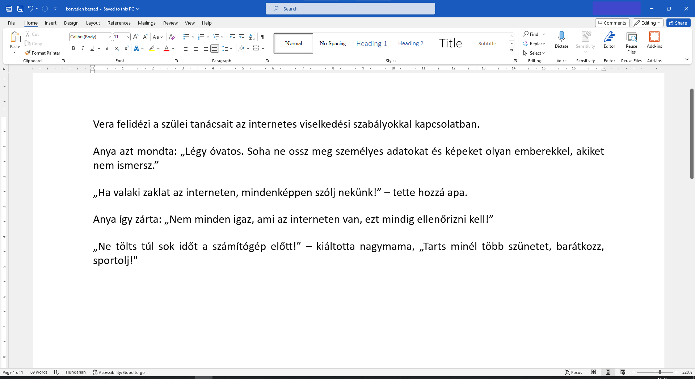
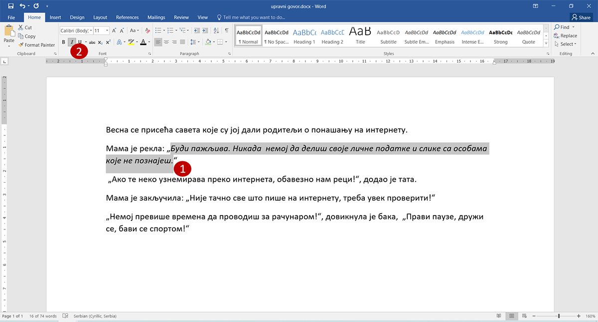

Dőlt betűs szöveg
=================

.. questionnote::
 
 Elmagyaráztuk, hogy mikor írjuk a szavakat vagy szövegrészeket félkövér betűkkel. Észrevettél-e a könyvekben még más írásmódot is? 
 Például enyhén dőlt betűkkel írt szöveget? Lapozd át a tankönyveidet, és találd meg azokat a szavakat, amelyek ilyen módon vannak írva! 
 
 Miért vannak ezek másképp írva, mi a jelentésük?
 
.. suggestionnote::

 Azokra a szavakra vagy szövegrészekre, amelyek kissé jobbra dőlő betűkből állnak, azt mondjuk, hogy **dőlt betűsen** vannak írva. 
 Gyakran ezt az írásmódot idegen szavakkal **kurzívnak** vagy **italiknak** is nevezzük. 
 
.. questionnote::

 Mikor írjuk a szöveget dőlt betűvel?
 
Amikor egy mondatban idegen szót használsz, és fontos, hogy a megjelenése eltérjen a szöveg többi részétől.

Dőlt betűket használnak könyvek, folyóiratok, filmek címeinek, illetve egyes szakkifejezések írásánál is.

Amikor egész mondatokat látsz dőlt betűkkel írva, az azt jelenti, hogy idézetről van szó, tehát pontosan úgy van leírva, ahogyan azt valaki kimondta.

A közvetlen beszéd is gyakran így jelenik meg a szövegben, idézőjelek használata helyett. 

|

Íme egy rövidebb gyakorlat. Nyiss meg egy új, üres dokumentumot, és gépeld be a következő szöveget! 

Mentsd el ezt a dokumentumot *kozvetlen beszed.docx* néven!

Olvasd el még egyszer a begépelt szöveget, majd válaszolj a kérdésekre: 

.. questionnote::

 Milyen tanácsokat adtak Verának a szülei és a nagymamája az interneten való viselkedéssel kapcsolatban? Igazuk van?

 Mit tanácsolnál Verának?

 Ezekben a mondatokban közvetlen vagy közvetett beszédet használtak?

A feladatod az, hogy kiemeld a közvetlen beszédet reprezentáló szövegrészeket úgy, hogy azok dőlt betűvel legyenek írva.

|

Hogyan lehet dőlt betűsen írni egy dokumentumban?

|

Segítünk neked a szöveg első olyan mondatánál, amely közvetlen beszédet tartalmaz. Jelöld ki a szövegrészt úgy, ahogy az alábbi képen látható (1), majd kattints az *I* betűvel jelölt gombra (2)! Dőltté váltak a betűk? Ha nem, próbáld újra...

.. questionnote::

 Módosítsd a többi közvetlen beszédet tartalmazó szövegrészt is úgy, hogy dőlt betűsen legyenek írva!

 Írd át az összes mondatot közvetett beszédre, és gépeld le őket az adott szöveg alá! Mentsd el a dokumentumot!

.. infonote::

 A dőlt betűs íráshoz a **Ctrl + I** billentyűkombináció is használható.
