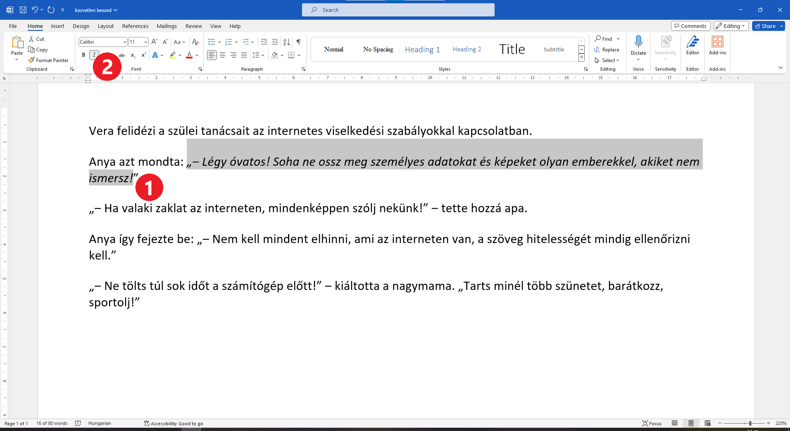

Dőlt betűs szöveg
=================

.. questionnote::
 
 Elmagyaráztuk, hogy mikor írjuk a szavakat vagy szövegrészeket félkövér betűkkel. Észrevettél-e a könyvekben még más írásmódot is? 
 Például enyhén dőlt betűkkel írt szöveget? Lapozd át a tankönyveidet, és találd meg azokat a szavakat, amelyek ilyen módon vannak írva. 
 
 Miért vannak ezek másképp írva, mi a jelentésük?
 
.. suggestionnote::

 За речи или делове текста који су написани искошено, словима благо нагнутим у десну страну кажемо да су писане 
 **курзивом**. Често се овај стил писања назива и **италик**.
 
.. questionnote::

 Када се текст пише искошеним словима?
 
Када у реченици користиш неку страну реч, па је потребно да се разликује од остатка текста. 

Искошена слова користе се и за писање наслова књига, часописа, филмова, неких стручних појмова.

Када видиш целе реченице писане курзивом, значи да је у питању неки цитат, да је нешто пренесено дословно, управо 
онако како је нека особа изговорила. 

Управни говор се често, уместо у наводницима, пише на овај начин.

|

Ево и једне краће вежбе. Отвори нови, празан документ и унеси следећи текст. 

.. image:: ../../_images/kurziv1.png
	:width: 800
	:align: center

Сачувај документ као *upravni govor.docx*.

Прочитај још једном текст и одговори на питања:

.. questionnote::

 Које су савете родитељи и бака дали Весни о понашању на интернету? Да ли су у праву?

 Шта би ти саветовао Весни?
 
 Да ли је у овим реченицама коришћен управни или неуправни говор?

Твој задатак је да истакнеш делове текста који представљају управни говор тако да буду писани искошеним 
словима (курзивом).

|

Како да добијеш искошена слова у документу?

|

Помоћи ћемо ти око прве реченице у тексту која преставља управни говор. Селектуј је као што је приказано на слици 
испод (1), а затим кликни на дугменце са ознаком *I* (2). Да ли су слова постала искошена? Ако нису, покушај поново…

.. questionnote::

 Измени и остале делове текста који престављају управни говор тако да буду написани курзивом.
 
 Пребаци све реченице у неуправни говор и испиши их испод датог текста. Сачувај документ.

.. infonote::

 За писање искошених слова користи се и комбинација тастера **Ctrl + I**.
