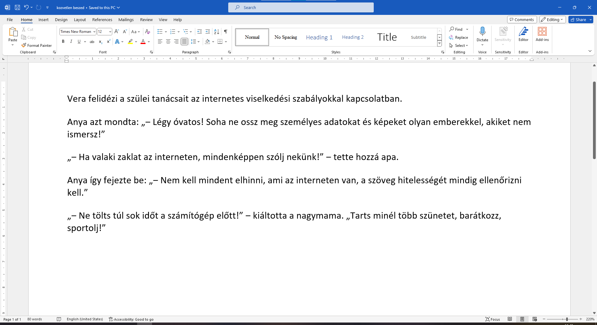

Dőlt betűs szöveg
=================

.. questionnote::
 
 Elmagyaráztuk, hogy mikor írjuk a szavakat vagy szövegrészeket félkövér betűkkel. Észrevettél-e a könyvekben még más írásmódot is? 
 Például enyhén dőlt betűkkel írt szöveget? Lapozd át a tankönyveidet, és találd meg azokat a szavakat, amelyek ilyen módon vannak írva. 
 
 Miért vannak ezek másképp írva, mi a jelentésük?
 
.. suggestionnote::

 Azokra a szavakra vagy szövegrészekre, amelyek kissé jobbra dőlő betűkből állnak, azt mondjuk, hogy **dőlt betűsen** vannak írva. 
 Gyakran ezt az írásmódot idegen szavakkal **kurzívnak** vagy **italiknak** is nevezik. 
 
.. questionnote::

 Mikor írják a szöveget dőlt betűvel?
 
Amikor egy mondatban idegen szót használsz, és fontos, hogy a megjelenése eltérjen a szöveg többi részétől.

Dőlt betűket használnak könyvek, folyóiratok, filmek címeinek, illetve egyes szakkifejezések írásánál is.

Amikor egész mondatokat látsz dőlt betűkkel írva, az azt jelenti, hogy idézetről van szó, tehát pontosan úgy van leírva, ahogyan azt valaki kimondta.

A közvetlen beszéd is gyakran így jelenik meg a szövegben, idézőjelek használata helyett. 

|

Íme egy rövidebb gyakorlat. Nyiss meg egy új, üres dokumentumot, és gépeld be a következő szöveget. 

Mentsd el ezt a dokumentumot *közvetlen beszéd.docx* néven.

Olvasd el még egyszer a begépelt szöveget, majd válaszoltj a kérdésekre: 

.. questionnote::

 Које су савете родитељи и бака дали Весни о понашању на интернету? Да ли су у праву?

 Шта би ти саветовао Весни?
 
 Да ли је у овим реченицама коришћен управни или неуправни говор?

Твој задатак је да истакнеш делове текста који представљају управни говор тако да буду писани искошеним 
словима (курзивом).

|

Како да добијеш искошена слова у документу?

|

Помоћи ћемо ти око прве реченице у тексту која преставља управни говор. Селектуј је као што је приказано на слици 
испод (1), а затим кликни на дугменце са ознаком *I* (2). Да ли су слова постала искошена? Ако нису, покушај поново…

.. image:: ../../_images/kurziv2.png
	:width: 800
	:align: center

.. questionnote::

 Измени и остале делове текста који престављају управни говор тако да буду написани курзивом.
 
 Пребаци све реченице у неуправни говор и испиши их испод датог текста. Сачувај документ.

.. infonote::

 За писање искошених слова користи се и комбинација тастера **Ctrl + I**.
