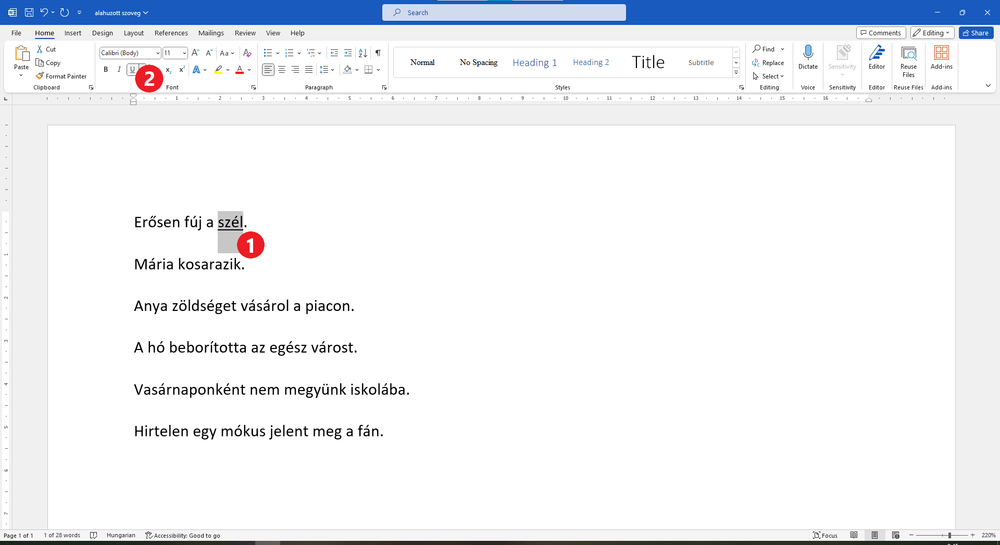

Aláhúzott szöveg
================

Ismételjünk át még egy kicsit a nyelvtant.

Biztosan találkoztál már az anyanyelv órákon ehhez hasonló feladattal: *„Egyszer húzd alá az alanyt a mondatban, kétszer húzd alá az állítmányt.“*

Tegyük fel, hogy meg kell határoznod a szavak szerepét a következő mondatokban, és az aláhúzást egy digitális dokumentumban kell elvégezned.

Nyiss egy új dokumentumot, és gépeld be a következő mondatokat:

.. image:: ../../_images/podvucen_1.png
	:width: 800
	:align: center

Mi az első mondat alanya? Húzzuk alá.

Jelöld ki a szél szót (1), majd kattints az **U** betűvel jelölt gombra. A *szél* szó aláhúzott lett.

Próbáld meg a következő mondat alanyát billentyűzet segítségével aláhúzni.

.. infonote::

 A dőlt betűs íráshoz a **Ctrl + U** billentyűkombináció is használható.
 
Húzd alá a többi mondat alanyát is (a neked tetsző módon). 

.. questionnote::

 Egy digitális dokumentumban vagy a papíron javítható könnyebben és tisztábban a hiba?

	
|

A feladat második része, hogy húzd alá a mondatok állítmányát, ezúttal kettős vonallal. Az eljárás nagyon hasonló az előzőhöz. 
A különbség az, hogy ezúttal az **U betű melletti nyílra** kell kattintanod. Nézd meg alaposan a gombot. Látod a nyilat (2)?

.. image:: ../../_images/podvucen_3.png
	:width: 800
	:align: center
	
Jelöld ki az első mondat állítmányát – a *fúj* szót. Kattints az **U** betű melletti nyílra a megjelölt gombon (2).

Egy ablak nyílik meg, amelyben különböző típusú aláhúzások láthatók. Válaszd ki, melyikkel szeretnéd aláhúzni a szót (3). 
Ha mindent jól csináltál, a fúj szó kettős vonallal lesz aláhúzva.

.. suggestionnote::

 Бројем (4) обележена је могућност да промениш боју линије којом подвлачиш текст. Да ли ти и то може бити корисно? 
 
 Покушај сам да промениш боју линије за подвлачење!

.. questionnote::

 Подвуци све предикате у реченицама двоструком линијом и сачувај документ као *podvucen tekst.docx*.

.. infonote::

 Истицање текста можеш да урадиш на више начина. Пречице преко тастатуре исте су за скоро сва окружења у којима се обрађује текст:
 
 - да подебљаш текст - комбинација **Ctrl + B**,
 
 - да искосиш текст - комбинација **Ctrl + I**,
 
 - да подвучеш текст - комбинација **Ctrl + U**.
	

 Наравно, измене ће бити видљиве на тексту који претходно селектујеш.

.. learnmorenote::

 **Зашто B, I, U?**
 
 Ово су почетна слова речи енглеског језика које означавају следећу врсту слова:
 
 **B** (енг. *Bold*) – подебљано, назива се још и „масно“ 
 
 **I** (енг. *Italic*) – искошено, закривљено 
 
 **U** (енг. *Underline*) – подвучено

.. questionnote::

 Изабери врсту линије и подвуци објекте у реченицама претходног примера (уколико их има).

.. questionnote::

 Провери шта ће се десити ако прво притиснеш неки од дугмића за подебљавање, искошавање и подвлачење слова, па унесеш текст. Како су написана слова?
