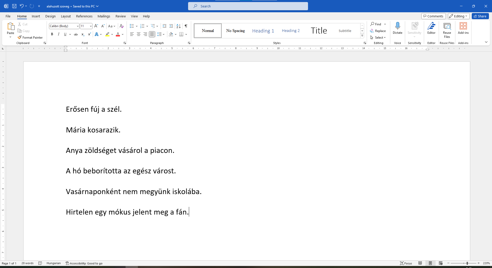

Aláhúzott szöveg
================

Ismételjünk át még egy kicsit a nyelvtant.

Biztosan találkoztál már az anyanyelv órákon ehhez hasonló feladattal: *„Egyszer húzd alá az alanyt a mondatban, kétszer húzd alá az állítmányt.“*

Tegyük fel, hogy meg kell határoznod a szavak szerepét a következő mondatokban, és az aláhúzást egy digitális dokumentumban kell elvégezned.

Nyiss egy új dokumentumot, és gépeld be a következő mondatokat:

Mi az első mondat alanya? Húzzuk alá.

Jelöld ki a szél szót (1), majd kattints az **U** betűvel jelölt gombra. A *szél* szó aláhúzott lett.

Próbáld meg a következő mondat alanyát billentyűzet segítségével aláhúzni.

.. infonote::

 A dőlt betűs íráshoz a **Ctrl + U** billentyűkombináció is használható.
 
Húzd alá a többi mondat alanyát is (a neked tetsző módon). 

.. questionnote::

 Да ли је лакше и уредније исправити грешку у дигиталном документу или на папиру?

.. image:: ../../_images/podvucen_2.png
	:width: 800
	:align: center
	
|

Други део задатка је да подвучеш предикате реченица, овог пута двоструком линијом. Начин на који то радиш је врло 
сличан претходном. Разлика је у томе што овог пута треба да кликнеш **на стрелицу поред слова U**. Погледај пажљиво 
дугменце. Да ли видиш стрелицу (2)?

.. image:: ../../_images/podvucen_3.png
	:width: 800
	:align: center
	
Селектуј предикат прве реченице – реч *дува*. Кликни на стрелицу поред слова **U** на приказаном дугменцету (2). 

Отворио ти се прозор у ком су приказане различите врсте линија за подвлачење. Изабери којом желиш да подвучеш своју реч 
(3). Ако си све урадио како треба, реч дува подвучена је двоструком линијом.

.. suggestionnote::

 Бројем (4) обележена је могућност да промениш боју линије којом подвлачиш текст. Да ли ти и то може бити корисно? 
 
 Покушај сам да промениш боју линије за подвлачење!

.. questionnote::

 Подвуци све предикате у реченицама двоструком линијом и сачувај документ као *podvucen tekst.docx*.

.. infonote::

 Истицање текста можеш да урадиш на више начина. Пречице преко тастатуре исте су за скоро сва окружења у којима се обрађује текст:
 
 - да подебљаш текст - комбинација **Ctrl + B**,
 
 - да искосиш текст - комбинација **Ctrl + I**,
 
 - да подвучеш текст - комбинација **Ctrl + U**.
	

 Наравно, измене ће бити видљиве на тексту који претходно селектујеш.

.. learnmorenote::

 **Зашто B, I, U?**
 
 Ово су почетна слова речи енглеског језика које означавају следећу врсту слова:
 
 **B** (енг. *Bold*) – подебљано, назива се још и „масно“ 
 
 **I** (енг. *Italic*) – искошено, закривљено 
 
 **U** (енг. *Underline*) – подвучено

.. questionnote::

 Изабери врсту линије и подвуци објекте у реченицама претходног примера (уколико их има).

.. questionnote::

 Провери шта ће се десити ако прво притиснеш неки од дугмића за подебљавање, искошавање и подвлачење слова, па унесеш текст. Како су написана слова?
