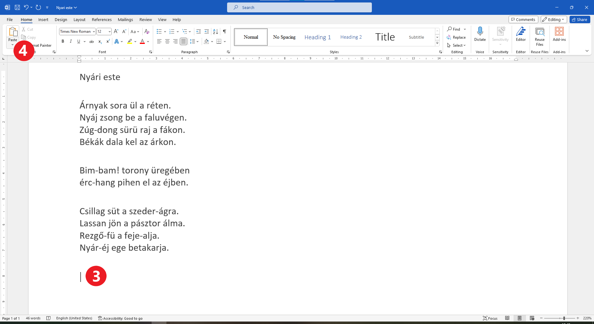
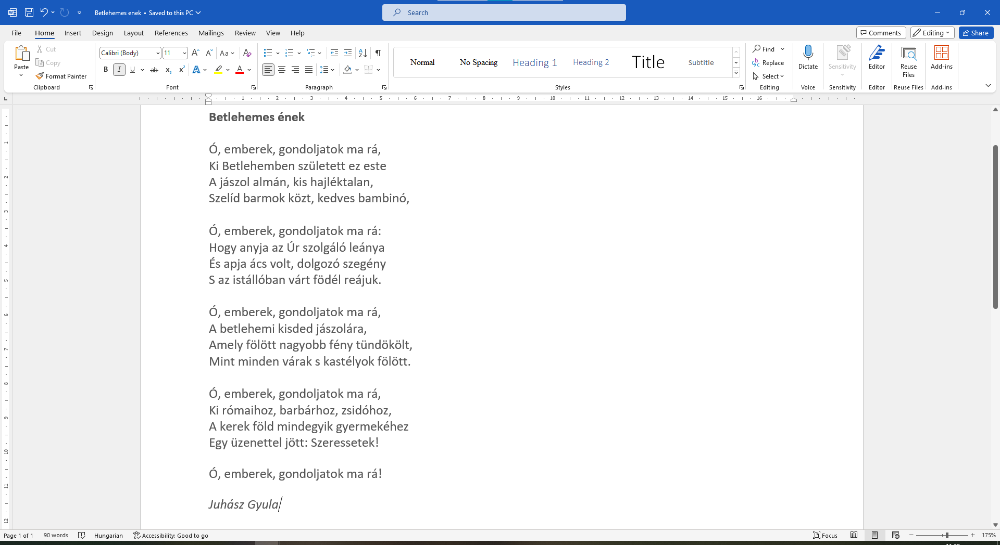

A szöveg másolása, kivágása és beillesztése
===========================================

Képzeld el a következő helyzetet: egy fogalmazást írsz a füzetedbe. Leírsz egy bekezdést, amelyről úgy gondolod, hogy nagyszerű bevezető lenne. Továbbírod a fogalmazást, de hibákat követsz el, és áthúzol dolgokat. Elérsz a befejező részhez, és rájössz, hogy éppen az a két mondat a bevezető részből jobban illene a befejezéshez. Mit fogsz csinálni?

Az egyik lehetőség, hogy áthúzod vagy zárójelbe teszed őket, majd átírod a befejező részbe (az mindenképp látszani fog, hogy áthelyezted a szöveget, és talán rendetlenül fog kinézni).

A másik lehetőség, hogy a bevezetőben hagyod ezeket a mondatokat, majd a befejezésben ismét leírod őket (ami nem a legjobb megoldás).

Számítógépen ezt sokkal elegánsabban meg lehet oldani. Akár az első, akár a második fent említett lehetőségről van szó, nem kell újraírnod a szöveget. Egyszerűen kimásolhatod és (nyom nélkül) áthelyezheted a szövegrészeket.

Először végezd el a következő gyakorlatot! Ez a szép vers példaként fog szolgálni arra, hogy elmagyarázzuk, miként kell megcsinálni a fent leírtakat...

A szöveg másolása
~~~~~~~~~~~~~~~~~

A következő feladatod az, hogy begépeld Ljubivoje Ršumović „*A gyerekek tudnak repülni*” című versét.

Észre fogod venni, hogy a versben van egy rész, amely ismétlődik – ez a refrén. A digitális dokumentum egyik előnye, hogy nem kell ugyanazt a szöveget többször begépelni. Csak egyszer gépeld be a refrén szövegét, majd később másold be a második versszak alá. Hogyan kell ezt csinálni?

Jelöld ki a refrén szövegét (1)! Kattints a *Copy* (Másolás) gombra az ablak bal felső sarkában (2)!

.. image:: ../../_images/kopiranje_1.png
	:width: 800
	:align: center

Most a kiválasztott szöveg átmenetileg a számítógép memóriájába kerül.

Kövesd az alábbi képet! Kattints (helyezd el a kurzort) arra a helyre, ahol meg szeretnéd jeleníteni a szöveget (3), majd kattints a *Paste* (Beillesztés) felirat feletti ikonra (4)!
	

.. questionnote::

 Mi történt?

Amikor kimásolsz egy szöveget, az az eredeti helyén is megmarad, és megjelenik az általad kiválasztott helyen is (ahová a kurzort helyezted).

Gyakran sokkal hasznosabb a billentyűzettel történő másolás. Ilyen eset az, amikor nem a Wordben dolgozol, hanem más programkörnyezetből másolsz át szövegeket és egyéb tartalmakat. Az eljárás nagyon hasonló az előzőhöz.

Ez is négy alapvető lépésből áll.

.. infonote::

 Szövegrészek másolása billentyűzettel:

 - Jelöld ki a szöveget!
 - Nyomd meg a **Ctrl + C** billentyűkombinációt!
 - Helyezd a kurzort arra a helyre, ahová a szöveget szeretnéd másolni!
 - Nyomd meg a **Ctrl + V** billentyűkombinációt!

.. questionnote::

 Másold át a vers részleteit ily módon!

|

A szöveg áthelyezése
~~~~~~~~~~~~~~~~~~~~

Ha nincs szükséged az eredeti szövegre, utólag törölheted, és úgy fog tűnni, mintha csak áthelyezted volna.

Természetesen az áthelyezésre létezik egy másik eljárás is, amit hamarosan be fogunk mutatni.

Gyakorlatképpen emeld ki a szövegrészeket félkövér betűkkel, és add hozzá a szerző nevét, ahogyan az alábbi képen is látható!

Helyezzük át a költő nevét a vers alá! Kövesd az alábbi képet! Jelöld ki a költő nevét! Ezúttal kattints az olló ikonnal jelzett gombra, melynek a neve *Cut* (Kivágás) (2)!

.. image:: ../../_images/premestanje_2.png
	:width: 800
	:align: center

A költő neve eltűnt. Helyezd el a kurzort (vagyis kattints) arra a helyre, ahová át szeretnéd helyezni, és az előzőekhez hasonlóan kattints a *Paste* (Beillesztés) gombra (4)!

.. image:: ../../_images/premestanje_3.png
	:width: 800
	:align: center
	
A vers szövege ezek után így néz ki: 

.. image:: ../../_images/premestanje_4.png
	:width: 800
	:align: center

.. infonote::

 Amikor másolod (*Copy*) vagy kivágod (*Cut*) a szövegrészeket, azok ideiglenesen a memóriában maradnak, és 
 többször is beillesztheted (*Paste*) őket oda, ahova szeretnéd!

Gyakorold a szöveg billentyűzet segítségével való áthelyezését!

.. infonote::

 Szöveg áthelyezése billentyűzet segítségével:

 - Jelöld ki a szöveget!

 - Nyomd meg a **Ctrl + X** billentyűkombinációt!

 - Helyezd át a kurzort arra a helyre, ahova másolni szeretnéd a szöveget!

 - Nyomd meg a **Ctrl + V** billentyűkombinációt!

Itt van egy feladat, amely a szöveg áthelyezésének gyakorlására szolgál:

.. questionnote::

 Nyiss meg egy új dokumentumot! Gépeld be Duško Radovićnak azt a versét, amely az alábbi képen olvasható!
 Gyakorold a másolást és az áthelyezést úgy, hogy nem gépeled be többször is az ismétlődő szövegrészeket!

Mentsd el a dokumentumot *A gyerekek szeretik.docx* néven!
