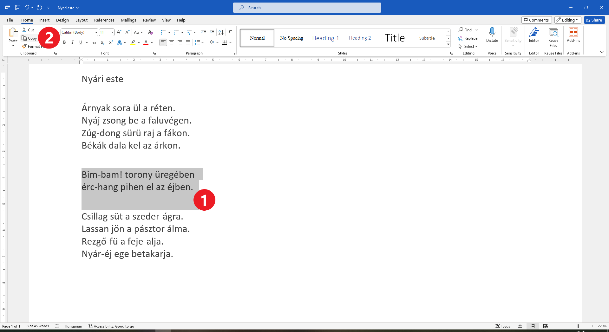
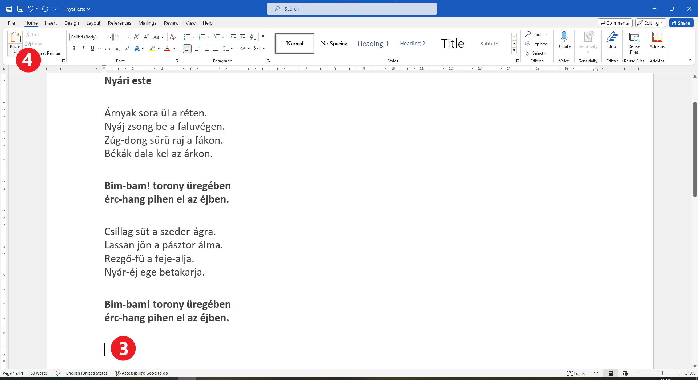

A szöveg másolása, kivágása és beillesztése
===========================================

Képzeld el a következő helyzetet: egy fogalmazást írsz a füzetedbe. Írsz egy bekezdést, amelyről úgy gondolod, hogy nagyszerű bevezető lenne. Tovább írsz. Hibákat követsz el, áthúzol dolgokat. Elérsz a befejező részhez... és pont az a két mondat a bevezetőből jobban illene a befejezéshez! Mit fogsz csinálni?

Az egyik lehetőség, hogy áthúzod vagy zárójelbe teszed őket, majd átírod a befejező részbe (az mindenképp látszani fog, hogy áthelyezted a szöveget, és talán rendetlenül fog kinézni).

A másik lehetőség, hogy a bevezetőben hagyod őket, majd újra leírod a befejezésben (ami nem a legjobb megoldás).

Számítógépen ezt sokkal elegánsabban lehet megoldani. Akár az első, akár a második fent említett lehetőségről van szó, nem kell újraírnod a szöveget. Egyszerűen kimásolhatod és (nyom nélkül) áthelyezheted a szövegrészeket.

Kezdetnek végezd el a következő gyakorlatot! Ez a szép vers példaként fog szolgálni arra, hogy elmagyarázzuk, miként kell ezt csinálni...

A szöveg másolása
~~~~~~~~~~~~~~~~~

A következő feladatod az, hogy begépeld Ljubivoje Ršumović „*A gyerekek tudnak repülni*” című versét.

Észre fogod venni, hogy a versben van egy rész, amely ismétlődik – ez a refrén. A digitális dokumentum egyik előnye, hogy nem kell ugyanazt a szöveget többször begépelni. Csak egyszer gépeld be a refrén szövegét, majd később másold be a második versszak alá. Hogyan kell ezt csinálni?

Jelöld ki a refrén szövegét (1). Kattints a *Copy* gombra az ablak bal felső sarkában (2).

Most a kiválasztott szöveg átmenetileg a számítógép memóriájába kerül.

Kövesd az alábbi képet. Kattints (helyezd el a kurzort) arra a helyre, ahol meg szeretnéd jeleníteni a szöveget (3), majd kattints a *Paste* felirat feletti ikonra (4).
	
.. image:: ../../_images/kopiranje_2.png
	:width: 800
	:align: center

.. questionnote::

 Mi történt?

Amikor kimásolsz egy szöveget, az az eredeti helyén is megmarad, és megjelenik az általad kiválasztott helyen is (ahová a kurzort helyezted).

Gyakran sokkal hasznosabb a billentyűzettel történő másolás. Ilyen eset az, amikor nem a Word-ben dolgozol, hanem más program környezetből másolsz át szövegeket és egyéb tartalmakat. Az eljárás nagyon hasonló az előzőhöz.

Ez is négy alapvető lépésből áll.

.. infonote::

 Szövegrészek másolása billentyűzettel:

 - Jelöld ki a szöveget.
 - Nyomd meg a **Ctrl + C** billentyűkombinációt.
 - Helyezd a kurzort arra a helyre, ahová a szöveget szeretnéd másolni.
 - Nyomd meg a **Ctrl + V** billentyűkombinációt.

.. questionnote::

 Másold át a vers részleteit ily módon!

|

A szöveg áthelyezése
~~~~~~~~~~~~~~~~~~~~

Ha nincs szükséged az eredeti szövegre, utólag törölheted, és úgy fog tűnni, mintha csak áthelyezted volna.

Természetesen az áthelyezéshez létezik egy másik eljárás is, amit hamarosan be fogunk mutatni.

Gyakorlatképpen, emeld ki a szövegrészeket félkövér betűkkel, és add hozzá a szerző nevét, ahogyan az alábbi képen is látható.

.. image:: ../../_images/premestanje_1.png
	:width: 800
	:align: center

Хајде да име песника поставимо испод песме. Прати слику испод. Селектуј име песника. Кликни (овог пута) на дугменце са 
сликом маказа, *Cut* (исеци), (2).

.. image:: ../../_images/premestanje_2.png
	:width: 800
	:align: center

Име песника је нестало. Постави курсор (кликни) на место на које желиш да га преместиш и, као и у претходном случају, 
кликни на дугменце *Paste* (налепи) (4).

	
Песмица сада изгледа овако:

.. image:: ../../_images/premestanje_4.png
	:width: 800
	:align: center

.. infonote::

 Када копираш (*Copy*) или исецаш (*Cut*) делове текста, они остају привремено сачувани у меморији и можеш да их 
 налепиш (*Paste*) више пута где желиш!

Увежбај премештање текста и преко тастатуре!

.. infonote::

 Премештање текста (преко тастатуре):

 - Селектуј текст.
 
 - Притисни на тастатури комбинацију тастера **Ctrl + X**.
 
 - Постави курсор на место где желиш да копираш текст.
 
 - Притисни комбинацију **Ctrl + V**.

Ево једног задатка који ти одлично може послужити за вежбу:

.. questionnote::

 Отвори нови документ. Унеси песму Душка Радовића која се налази на слици испод. Увежбај копирање и премештање тако 
 што нећеш више пута уносити делове текста који се понављају.

.. image:: ../../_images/deca_vole.png
	:width: 800
	:align: center

Документ сачувај као *Deca vole.docx*.
