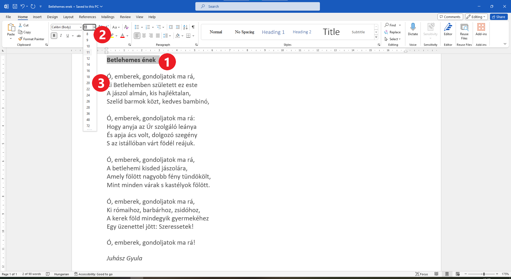
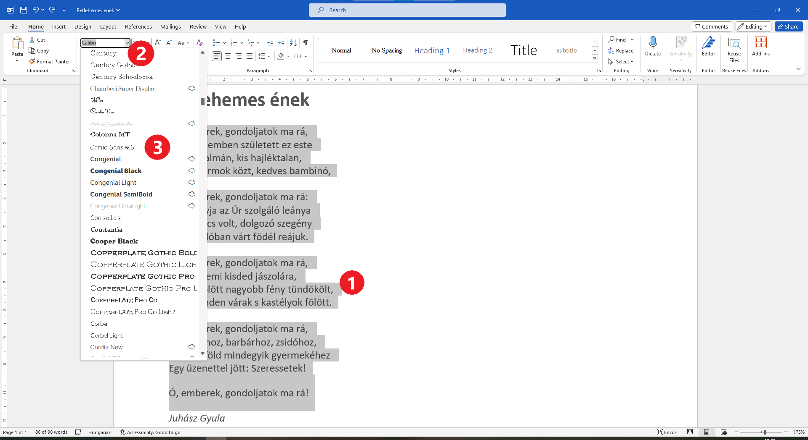
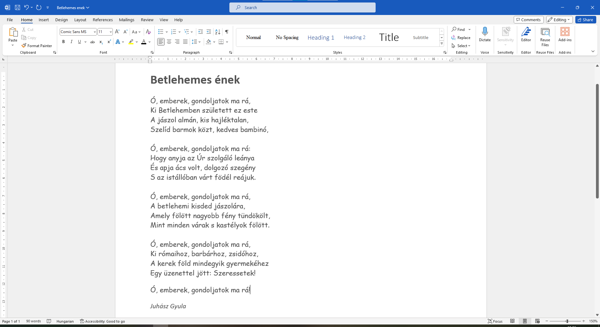

Betűméret és betűtípus
======================

Dusko Radović egyik kis verse segíteni fog nekünk abban, hogy bemutassuk számodra a szövegkiemelés további lehetőségeit. 
Arról van szó, hogy megváltoztatjuk a betűk méretét és formáját. Ezekkel a lehetőségekkel már találkoztál a Paintben.

.. questionnote::

 Hogyan lehet megváltoztatni a betűméretet a Wordben?

Ha fellapozod akármelyik folyóiratot vagy tankönyvet, észre fogod venni, hogy a címek gyakran nagyobb betűkkel vannak kinyomtatva, mint a szöveg többi része. Alakítsuk át ilyen módon *A gyerekek szeretnek* vers címét is.

Nyisd meg *A gyerekek szeretnek.docx* dokumentumot.

Kövesd az alábbi képet. Jelöld ki a címet (1), majd kattints a nyílra, amely a számot tartalmazó mező mellett található (2). Válassz egyet a felkínált értékek közül (például: 20) (3).

A cím most nagyobb betűkkel van kiírva, mint a szöveg többi része.

------------

У свесци можеш да пишеш штампаним и писаним словима. Слова могу да буду округла, дугуљаста, нагнута у једну или другу страну. 
Различити људи имају различите рукописе.

Слично томе, када уносиш текст у рачунар можеш да изабереш облик слова која користиш.

У рачунару постоје различити **фонтови**. То су групе знакова које имају заједнички графички облик.

Хајде да променимо фонт којим је написана ова песмица. Селектуј текст као на слици испод (1) и кликни на стрелицу поред оквира са називима фонтова. (2)

Изабери фонт који желиш. На пример, *Comic Sans*. 

Текст који је био селектован сада је променио облик слова.

.. questionnote::

 Увежбај промену величине и облика слова тако што ћеш за сваку строфу, наслов и име песника изабрати другачији фонт и вредност.

Погледај још једном измењени документ. Да ли је садржај јасно приказан?

.. infonote::

  Приликом истицања делова текста (промена боје, величине и облика слова, подвлачења, подебљавања...), води рачуна да **превише шаренила може да скрене пажњу са садржаја**!

 
