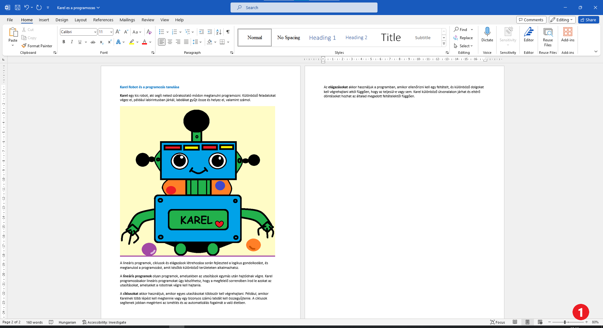

Kép beillesztése a dokumentumba
===============================

.. infonote::

 Ebben a leckében megtanulod, hogy miként...

 - illeszthetsz be képet a dokumentumodba,

 - helyezheted el a képet a kívánt módon a szöveghez viszonyítva,

 - hozhatsz létre keretet a kép körül.
 
Képzeld el ezt a tankönyvet képek nélkül. Mennyivel bonyolultabbak lennének az itt található útmutatók? Nézd meg a Természet és társadalom című tankönyvet.
Vannak-e benne illusztrációk, fényképek? Mi mindent ábrázolnak ezek a képek?

.. questionnote::

 Ismered az „egy kép többet ér ezer szónál“ mondást? Mit jelent ez? Egyetértesz ezzel?
 
A képet több okból is illeszthetünk egy dokumentumba. Szolgálhatnak illusztrációként, megjeleníthetnek ötleteket, információkat. 
A különböző grafikonok és diagramok hasznosak lehetnek összetett adatok megjelenítésére. Az így bemutatott adatok biztosan 
áttekinthetőbbek és könnyebben érthetőek.

Ebben a tankönyvben a képek útmutatásként szolgálnak – elmagyarázzák azokat a lépéseket, amelyeket meg kell tenned. 
Néha a képeket csak azért használjuk, hogy vonzóbbá tegyék az olvasottakat.

A dokumentumban szereplő képeknek megfelelőekek kell lenniük, és kapcsolódniuk kell annak tartalmához, 
hogy az olvasók jobban megértsék az információkat.

Hogyan lehet a Wordben képet hozzáadni a dokumentumhoz? Ezt egy konkrét példával magyarázzuk el - beszúrunk egy képet a Karel robotról a *Karel es a programozas.docx* fájlba.

Nyisd meg ezt a dokumentumot!

Helyezd a kurzort az első bekezdés alá. Kattints az *Insert* (Beszúrás) (1) gombra, majd a *Pictures* (Képek) (2) gombra, ahogy az az alábbi ábrán látható.

.. image:: ../../_images/pic_1.png
	:width: 800
	:align: center

Појавио се следећи прозор (дијалог):
	

На левој страни прозора налази се списак фасцикли. Пронађи и кликни на фасциклу у којој се налази слика коју желиш да 
убациш у документ. У нашем случају то је *Pictures* (1).

На десној страни прозора приказано је шта се све налази у тој фасцикли. Ми имамо само једну слику. 
Ти ћеш сигурно видети још много слика које су направили твоји школски другари или чланови породице (ако вежбаш код куће). 

Кликни на слику коју желиш да убациш (2) и потврди са *Insert* (3).

.. technicalnote::

 У прозору са слике види се садржај слике коју убацујемо. Међутим, може се десити да код тебе буде приказан само њен 
 назив. Ако кликнеш на стрелицу означену са (4), можеш да промениш начин на који ће бити приказане слике које се налазе 
 у тој фасцикли.

Да ли се слика појавила у документу? Да ли је величине која ти одговара? Наша изгледа овако:
	
.. image:: ../../_images/pic_3.png
	:width: 800
	:align: center

Да би боље видео како изгледа документ, мало га „удаљи“. На слици испод са (1) је означен клизач који ти омогућава 
да документ посматраш из веће или мање близине, као и папир који држиш у руци.

.. infonote::

 Зумирање (приближавање и удаљавање документа) можеш у Ворду да радиш на више начина. Два „најбржа“ су:
 
 - држиш притиснут тастер **Ctrl** и помераш скрол (точкић) миша,
 
 - помераш клизач у доњем десном углу прозора, како је приказано на слици испод (1)

.. questionnote::

 Обрати пажњу, на ком месту у документу се појавила слика? Где би се појавила да си пре уметања курсор поставио испод текста?
	

Наша слика је много већа него што смо замислили, не уклапа се добро у овај документ. То, наравно, није проблем. 
У Ворду можеш да промениш величину слике и да је прилагодиш садржају.

