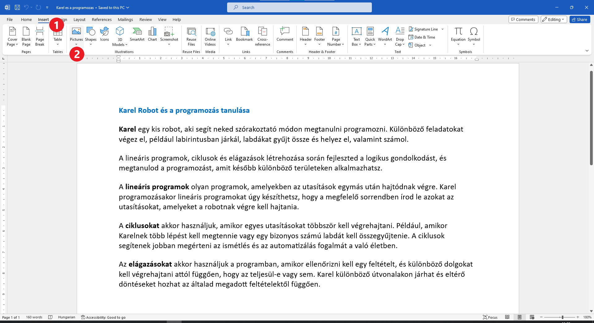

Kép beillesztése a dokumentumba
===============================

.. infonote::

 Ebben a leckében megtanulod, hogy miként...

 - illeszthetsz be képet a dokumentumodba,

 - helyezheted el a képet a kívánt módon a szöveghez viszonyítva,

 - hozhatsz létre keretet a kép körül.
 
 
Замисли овај приручник без слика. Колико би сложенија била упутства? Погледај приручник из Природе и друштва. 
Да ли у њему има илустрација, фотографија? Шта све може да се нађе на тим сликама?

.. questionnote::

 Да ли си некад чуо да неко каже да „једна слика вреди хиљаду речи“? Шта то значи? Да ли се слажеш са тим?
 
Слике се у документ убацују из више разлога. Могу да послуже као илустрације, да се визуелно прикажу неке идеје, 
информације. Различити графикони и дијаграми могу бити корисни за приказивање сложених података. Тако приказани подаци 
сигурно су прегледнији и лакше их је разумети. 

У случају овог приручника слике су употребљене као упутства – објашњавају кораке које треба да урадиш. Понекад се 
слике користе и само да би да би нам оно што читамо било привлачније.

Слике у документу треба да буду одговарајуће и повезане са оним о чему пишеш, како би читаоцима помогле 
да што боље разумеју информације.

Како у Ворду додајеш слику у свој документ? Објаснићемо ти на конкретном примеру – убацићемо слику робота Карела у *Karel i programiranje.docx*. 

Отвори овај документ!

Постави курсор испод првог пасуса. Кликни на *Insert* (1), а затим на *Pictures* (2) као што је приказано на слици испод.

Појавио се следећи прозор (дијалог):
	
.. image:: ../../_images/pic_2.png
	:width: 800
	:align: center

На левој страни прозора налази се списак фасцикли. Пронађи и кликни на фасциклу у којој се налази слика коју желиш да 
убациш у документ. У нашем случају то је *Pictures* (1).

На десној страни прозора приказано је шта се све налази у тој фасцикли. Ми имамо само једну слику. 
Ти ћеш сигурно видети још много слика које су направили твоји школски другари или чланови породице (ако вежбаш код куће). 

Кликни на слику коју желиш да убациш (2) и потврди са *Insert* (3).

.. technicalnote::

 У прозору са слике види се садржај слике коју убацујемо. Међутим, може се десити да код тебе буде приказан само њен 
 назив. Ако кликнеш на стрелицу означену са (4), можеш да промениш начин на који ће бити приказане слике које се налазе 
 у тој фасцикли.

Да ли се слика појавила у документу? Да ли је величине која ти одговара? Наша изгледа овако:
	
.. image:: ../../_images/pic_3.png
	:width: 800
	:align: center

Да би боље видео како изгледа документ, мало га „удаљи“. На слици испод са (1) је означен клизач који ти омогућава 
да документ посматраш из веће или мање близине, као и папир који држиш у руци.

.. infonote::

 Зумирање (приближавање и удаљавање документа) можеш у Ворду да радиш на више начина. Два „најбржа“ су:
 
 - држиш притиснут тастер **Ctrl** и помераш скрол (точкић) миша,
 
 - помераш клизач у доњем десном углу прозора, како је приказано на слици испод (1)

.. questionnote::

 Обрати пажњу, на ком месту у документу се појавила слика? Где би се појавила да си пре уметања курсор поставио испод текста?
	
.. image:: ../../_images/pic_4.png
	:width: 800
	:align: center

Наша слика је много већа него што смо замислили, не уклапа се добро у овај документ. То, наравно, није проблем. 
У Ворду можеш да промениш величину слике и да је прилагодиш садржају.

