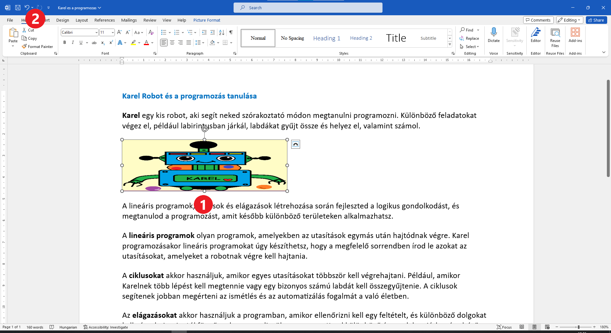
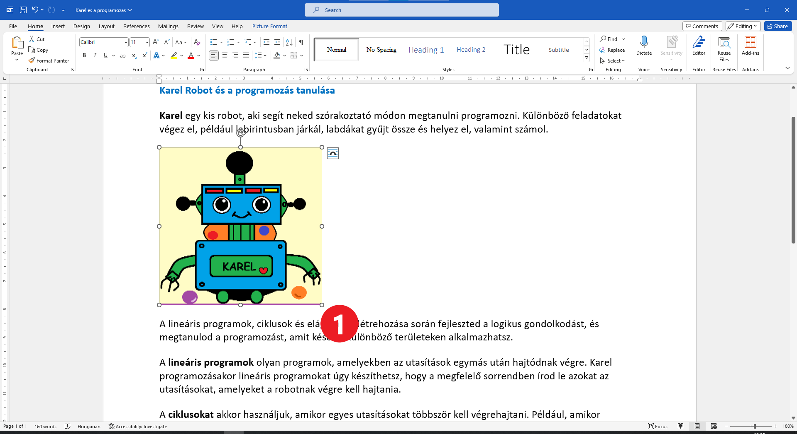

A kép mérete
============

.. questionnote::

 Kattints a képre. Megjelent valami? Észrevetted a nyolc fehér kört, amelyek a szélei mentén jelentek meg?

Négy köröcske van annak a téglalapnak sarkainál, amely a képet alkotja, és négy a szélei közepén. Kattints az egérrel 
a kis körre, amely a kép alsó szélének közepén található (1), és húzd felfelé (hogy csökkentsd a kép méretét). Mi történt?

A kép valóban kisebb lett, de megváltozott-e mindkét méret (a szélesség és a magasság is)? Úgy néz-e ki még mindig a robotod, 
ahogyan azt lerajzoltad? Szerencsére mindig visszaléphetsz egyet. Kattints a kör alakú nyílra (2), 
hogy visszaállítsd a képet az eredeti méretére!

	
Кликни сада на бели кружић који се налази у доњем десном углу слике. Држи притиснут тастер и „вуци“ кружић. 

Шта примећујеш?

Када за промену величине слике користиш кружиће у угловима (у теменима), однос њене висине и ширине остаће исти. 
Слика се неће деформисати.

Умањи или увећај слику по жељи.

.. questionnote::

 Кликни поново на слику и покушај да је помериш у било ком правцу – горе, доле, лево, десно! Да ли можеш то да урадиш?

|
