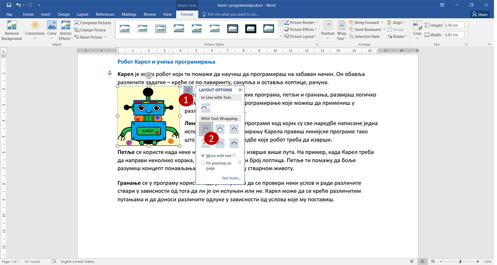
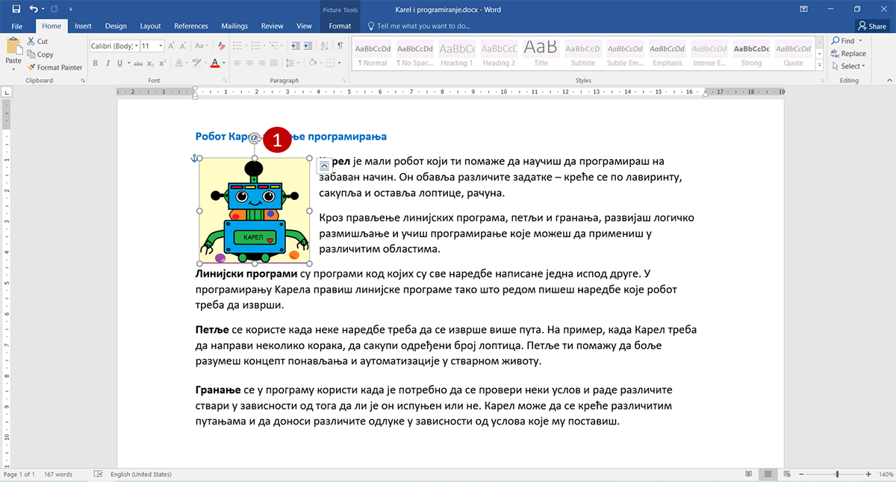
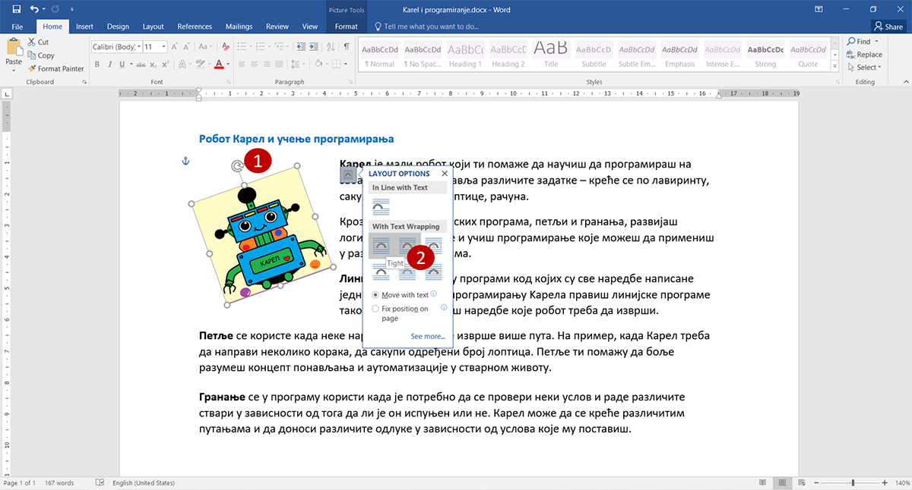
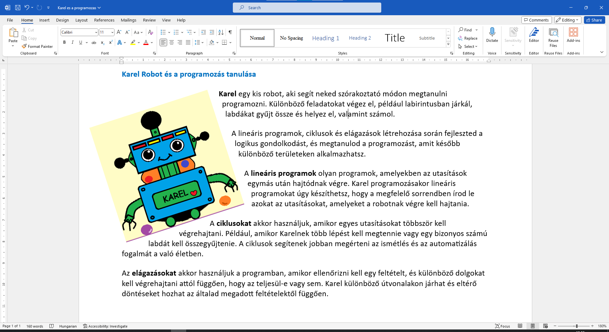

A kép helyzete a szöveghez viszonyítva
======================================

Amikor egy képet először helyezel el a dokumentumban, megváltoztathatod a méretét és forgathatod, de nem tudod áthelyezni. 
Ahhoz, hogy áthelyezhető legyen, először meg kell határoznod, hogyan legyen elhelyezve a szöveghez viszonyítva.

Több lehetőséged van – a kép lehet egy sorban a szöveggel vagy „tördelheti” azt, a szöveg ráíródhat a képre, a kép rákerülhet a szövegre, a szöveg követheti a kép széleit vagy téglalap alakú területet hozhat létre körülötte… A legjobb, ha ezeket egyenként kipróbálod.
	

Кликни на иконицу која се појави уз горњи десни угао слике када кликнеш на њу (1) и изабери опцију као на слици (2). 
Текст је окружио слику.

Покушај сада да помериш слику! Постави је као што је приказано у примеру испод.

Да ли си приметио и кружну стрелицу која се појави када кликнеш на слику у документу (1)?

Повуци је мишем у леву страну. 
	

.. questionnote::
	
 Шта се десило са сликом? А са текстом који је окружује?

Изабери сада следећи положај текста у односу на слику (2). 

.. questionnote::

 Како је сада постављен текст? У чему је разлика?
 
На сличан начин испробај шта се дешава када изабереш неку од преосталих могућности. Постави слику преко текста, 
текст преко слике… 

.. suggestionnote::

 Обрати пажњу на хоризонталне линије и полукружни облик на иконици коју си изабрао. У каквом су односу? Да ли су у истом односу и твој текст и слика после овог избора?

Када испробаш ове могућности, врати се неколико корака уназад, до оног пре ротирања слике (**Ctrl + Z**) или кликом 
на стрелицу у горњем левом углу прозора Ворда.

|
