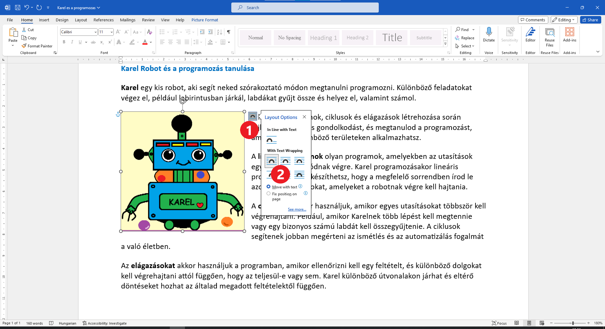
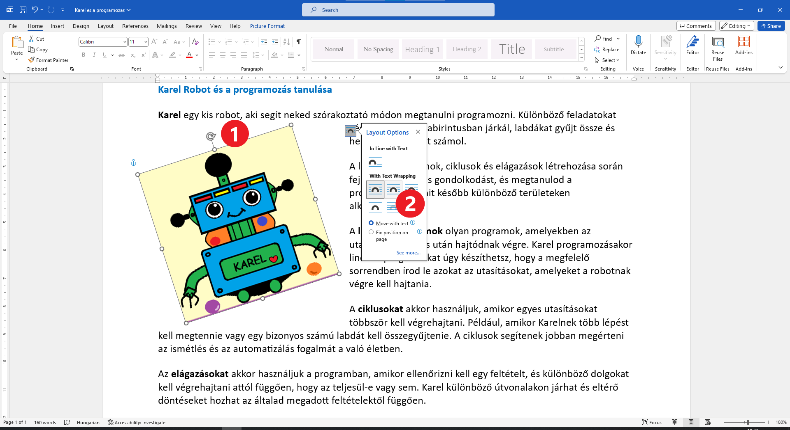

Позиција слике у односу на текст
================================

Када тек поставиш слику у документ, можеш да јој мењаш величину и да је ротираш (окрећеш), али не можеш да јој промениш 
место.  Да би омогућио померање, прво треба да одредиш како ће она да буде постављена у односу на текст.
 
Имаш неколико могућности – слика може да буде поравната са текстом или да га „преломи“, текст може да буде исписан 
преко слике, слика може да буде постављена преко текста, текст може да прати ивице слике или да око ње направи 
правоугаони простор… најбоље је их испробаш једну по једну.
	

Кликни на иконицу која се појави уз горњи десни угао слике када кликнеш на њу (1) и изабери опцију као на слици (2). 
Текст је окружио слику.

Покушај сада да помериш слику! Постави је као што је приказано у примеру испод.

.. image:: ../../_images/pic_8.png
	:width: 800
	:align: center

Да ли си приметио и кружну стрелицу која се појави када кликнеш на слику у документу (1)?

Повуци је мишем у леву страну. 
	

.. questionnote::
	
 Шта се десило са сликом? А са текстом који је окружује?

Изабери сада следећи положај текста у односу на слику (2). 

.. image:: ../../_images/pic_10.png
	:width: 800
	:align: center

.. questionnote::

 Како је сада постављен текст? У чему је разлика?
 
На сличан начин испробај шта се дешава када изабереш неку од преосталих могућности. Постави слику преко текста, 
текст преко слике… 

.. suggestionnote::

 Обрати пажњу на хоризонталне линије и полукружни облик на иконици коју си изабрао. У каквом су односу? Да ли су у истом односу и твој текст и слика после овог избора?

Када испробаш ове могућности, врати се неколико корака уназад, до оног пре ротирања слике (**Ctrl + Z**) или кликом 
на стрелицу у горњем левом углу прозора Ворда.

|
