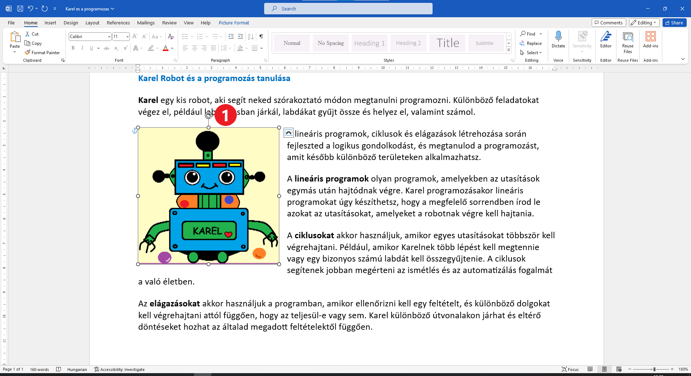

A kép helyzete a szöveghez viszonyítva
======================================

Amikor egy képet először helyezel el a dokumentumban, megváltoztathatod a méretét és forgathatod, de nem tudod áthelyezni. 
Ahhoz, hogy áthelyezhető legyen, először meg kell határoznod, hogyan legyen elhelyezve a szöveghez viszonyítva.

Több lehetőséged van – a kép lehet egy sorban a szöveggel, vagy „tördelheti” azt, a szöveg ráíródhat a képre, a kép rákerülhet a szövegre, a szöveg követheti a kép széleit, vagy téglalap alakú területet hozhat létre körülötte. A legjobb, ha ezeket egyenként kipróbálod.
	
.. image:: ../../_images/pic_7.png
	:width: 800
	:align: center

Kattints az ikonra, amely a kép jobb felső sarkában jelenik meg, majd amikor rákattintottál (1), válaszd ki a képen látható opciót (2)!
A szöveg körülölelte a képet.

Próbáld meg most elmozdítani a képet! Helyezd el úgy, ahogyan az az alábbi példában látható!

Észrevetted a kör alakú nyilat, amely megjelenik, amikor rákattintasz a képre (1)?

Húzd az egérrel balra!
	
.. image:: ../../_images/pic_9.png
	:width: 800
	:align: center

.. questionnote::
	
 Mi történt a képpel? És az azt körülvevő szöveggel?

Válaszd ki most a szöveg következő elhelyezkedését a képhez viszonyítva (2)!

.. image:: ../../_images/pic_10.png
	:width: 800
	:align: center

.. questionnote::

 Most hogy helyezkedik el a szöveg? Mi a különbség?
 
Hasonló módon próbáld ki, mi történik, amikor a fennmaradt lehetőségeket váasztod ki! Helyezd a képet a szövegre, a szöveget a képre...

.. suggestionnote::

 Figyeld meg a vízszintes vonalakat és a félkör alakzatot azon az ikonon, amit kiválasztottál! Milyen viszonyban vannak egymással? Ugyanabban a viszonyban van a szöveged és a képed is ezután a választás után?

Miután kipróbáltad ezeket a lehetőségeket, lépj vissza néhány lépést a kép forgatása előtti állapotba (**Ctrl + Z**), vagy kattints a nyílra a Word ablakának bal felső sarkában!

|
