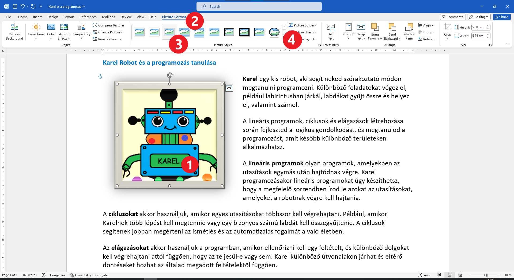

Képszegély hozzáadása
=====================

.. questionnote::

 Miért vannak bekeretezve a képek? Csak technikai okokból, hogy fel lehessen akasztani őket a falra, vagy hogy biztosabban álljanak a polcon?
 Minden keret ugyanolyan?
 
A dokumentumba helyezett kép nem eshet le. Nem emiatt van szüksége keretre vagy más néven szegélyre. Mégis, néha fontos számunkra, 
hogy a kép tartalma valamilyen módon elkülönüljön a szövegtől, vagy jobban kiemelkedjen. 
Például, ha fehér hátterű képet szeretnél fehér papírra helyezni.

A Word egyik képessége, hogy bekeretezheted vele a képet. Ahogy különböző keretek léteznek a valódi képekhez, 
úgy ezek a szegélyek is különböző színűek, vastagságúak és stílusúak lehetnek.

Be fogjuk keretezni Karel képét.

Kattints a képre (1)! Ha szeretnéd, valamelyest fel is nagyíthatod. A főmenüben megjelenik a *Format* (Formátum) (2) lehetőség, 
és alatta a különböző keretek (3). Ha nem vagy elégedett a választékkal, a nyílra kattintva (4) további kerettípusok közül választhatsz.

	
Lehet, hogy az általunk választott keret nem a legmegfelelőbb.

.. infonote::

 A képkeret kiválasztásakor ügyelj arra, hogy az összhangban legyen a dokumentum többi részével, és ne rontsa el a megjelenését!

