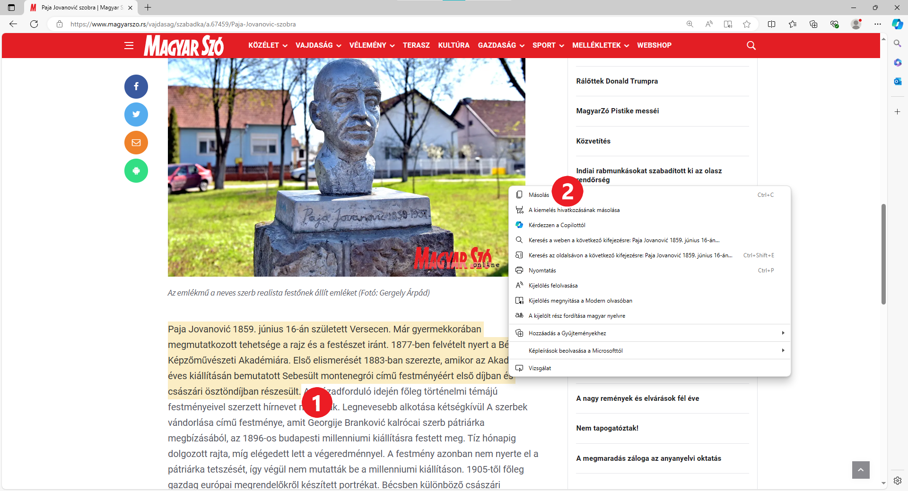

Szöveg letöltése az internetről
===============================

Mielőtt elkezdenéd a projektfeladatodat, végezd el a következő gyakorlatot.

Tegyük fel, hogy a „Szűkebb pátriám híres embere” című témát választottad, és a személy, akiről írni szeretnél, Paja Jovanović festőművész.

**Honnan kezdjük?**

Nyisd meg valamelyik neked tetsző böngészőt. Nyisd meg a keresőt, és írd be ennek a festőnek a nevét a keresőmezőbe (1).
Az alábbi képeken a *Microsoft Edge* böngészőt és a Google keresőt használtuk (*https://www.google.com/*).

Ezután kattints a *Google-keresés* gombra (2), ahogy az az alábbi képen látható.

.. image:: ../../_images/pretraga_1.png
	:width: 800
	:align: center

.. questionnote::

 Mit talált a kereső?
 
.. image:: ../../_images/pretraga_2.png
	:width: 800
	:align: center

A böngésző ablakának jobb szélén található egy csúszka (görgetősáv). Húzd lefelé, és nézd meg, milyen weboldalakon említik Paja Jovanovićot.

Kattints a linkekre, és gyűjts össze minél több információt. Például, hogy mikor és hol született a festő, miért híres, melyek az ismert művei, 
kikkel dolgozott együtt, ez-e az igazi neve...

A böngészőablak bal felső sarkában található nyílra kattintva (1) mindig visszatérhetsz a korábban megnyitott oldalakra, és máshol is kereshetsz információkat.
	
.. image:: ../../_images/pretraga_3.png
	:width: 800
	:align: center

Ismét emlékeztetünk:

.. questionnote::

 Nem kell minden igaz, amit az interneten írnak! Hogyan tudod ezt ellenőrizni?

Информације које су ти потребне налазе се на различитим сајтовима и то може да се претвори у проблем. 
Сада већ причамо о мало дужем тексту, који не можеш тако лако да запамтиш.

Добро би било да неке делове текста који су ти значајни копираш у један Ворд документ, како би били сви на једном месту.

.. infonote::

 Немој да заборавиш – ако дословно наводиш нечије речи или делове текста, стави их под знаке навода и напиши у дну 
 документа чије су или одакле си преузео текст!

Рецимо да си на неком сајту пронашао називе неколико портрета које је Паја насликао и желиш да их сачуваш у свом документу. 
Наравно, овај део вежбе можеш да урадиш и са било којим другим текстом који пронађеш. Уради следеће:

Селектуј део текста који желиш да копираш (као што си то радио и у Ворду). Десни клик на то што си селектовао (1). 

Појавиће се мали прозор као на слици испод (или сличан, зависно од прегледача који користиш). Кликни на *Copy* (2). 

Текст је привремено сачуван у меморији рачунара. Отвори сада нови Ворд документ и кликни на *Paste* (налепи). Текст ће 
се појавити у твом документу. 

На исти начин у документ можеш да додаш корисне информације са различитих сајтова. 

.. image:: ../../_images/pretraga_5.png
	:width: 800
	:align: center

Можеш да објединиш и делове текста које су пронашли или осмислили другари са којима радиш на пројектном задатку.

.. questionnote::

 Напиши својим речима шта си све научио о теми коју си проучавао. Припреми комплетан текст за свој документ.
 
.. infonote::
 
 Преузимање текста можеш да урадиш и преко тастатуре. Овај поступак је често бржи и практичнији: 
 
 Када селектујеш текст, притисни комбинацију тастера **Ctrl + C**. Отвори Ворд документ и постави курсор на место на ком желиш да се појави 
 текст. Притисни комбинацију тастера **Ctrl + V**.

