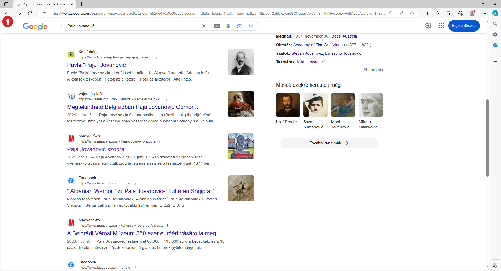
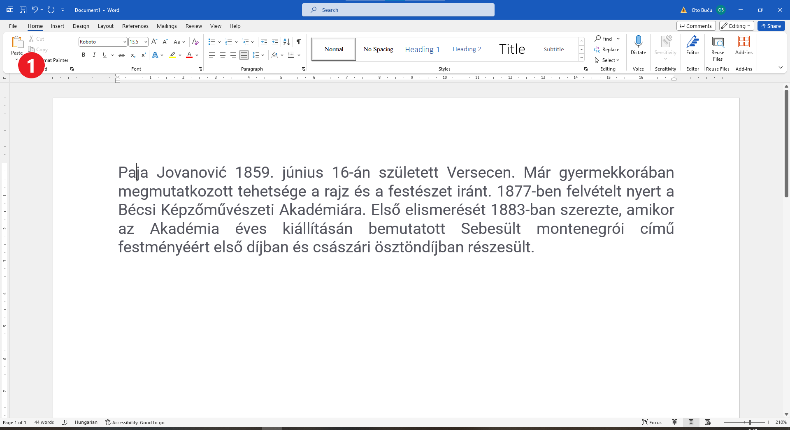

Преузимање текста са интернета
==============================

Пре него што отпочнеш израду свог пројектног задатка, уради следећу вежбу.

Претпоставимо да си за тему изабрао „Знаменита личност мога краја“ и да је личност о којој ћеш писати сликар 
Паја Јовановић.

**Одакле почети?**

Отвори прегледач који ти одговара. Отвори претраживач и унеси име и презиме овог сликара у поље за претраживање (1). 
На сликама испод коришћен је Мајкрософт Еџ (*Microsoft Edge*) и Гугл претраживач (*https://www.google.com/*)

Затим кликни на дугме са натписом *Google pretraga* (2), као што је приказано на слици испод.

.. image:: ../../_images/pretraga_1.png
	:width: 800
	:align: center

.. questionnote::

 Шта је пронашао претраживач?
 
.. image:: ../../_images/pretraga_2.png
	:width: 800
	:align: center

Дуж  десне ивице прозора налази се клизач. Померај га и погледај на којим се све сајтовима помиње Паја Јовановић. 

Кликни на линкове и  прикупи што је могуће више информација. Када је Паја рођен, где је рођен, по чему је познат, 
који су његови познати радови, са ким је сарађивао, да ли му је то право име…

Кликом на стрелицу у горњем левом углу прозора прегледача (1), увек можеш да се вратиш на претходно отворене странице 
и потражиш информације на неком другом месту.
	

Још једном те подсећамо:

.. questionnote::

 Не мора бити тачно све што пише на интернету! На који начин можеш то да провериш?

Информације које су ти потребне налазе се на различитим сајтовима и то може да се претвори у проблем. 
Сада већ причамо о мало дужем тексту, који не можеш тако лако да запамтиш.

Добро би било да неке делове текста који су ти значајни копираш у један Ворд документ, како би били сви на једном месту.

.. infonote::

 Немој да заборавиш – ако дословно наводиш нечије речи или делове текста, стави их под знаке навода и напиши у дну 
 документа чије су или одакле си преузео текст!

Рецимо да си на неком сајту називе неколико портрета које је Паја насликао и желиш да их сачуваш у свом документу. 
Наравно, овај део вежбе можеш да урадиш и са било којим другим текстом који пронађеш. Уради следеће:

Селектуј део текста који желиш да копираш (као што си то радио и у Ворду). Десни клик на то што си селектовао (1). 

Појавиће се мали прозор као на слици испод (или сличан, зависно од прегледача који користиш). Кликни на *Copy* (2). 

.. image:: ../../_images/pretraga_4.png
	:width: 800
	:align: center

Текст је привремено сачуван у меморији рачунара. Отвори сада нови Ворд документ и кликни на *Paste* (налепи). Текст ће 
се појавити у твом документу. 

На исти начин у документ можеш да додаш корисне информације са различитих сајтова. 

Можеш да објединиш и делове текста које су пронашли или осмислили другари са којима радиш на пројектном задатку.

.. questionnote::

 Напиши својим речима шта си све научио о теми коју си проучавао. Припреми комплетан текст за свој документ.
 
.. infonote::
 
 Преузимање текста можеш да урадиш и преко тастатуре. Овај поступак је често бржи и практичнији: 
 
 Када селектујеш текст, притисни комбинацију тастера **Ctrl + C**. Отвори Ворд документ и постави курсор на место на ком желиш да се појави 
 текст. Притисни комбинацију тастера **Ctrl + V**.

