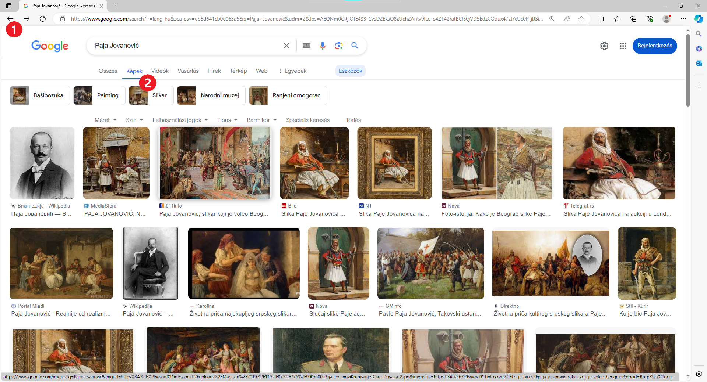
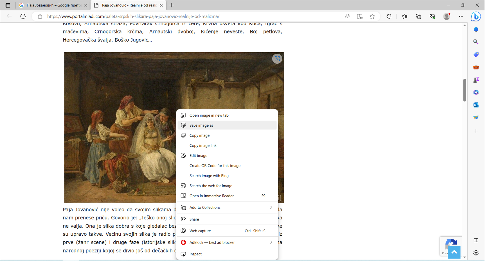
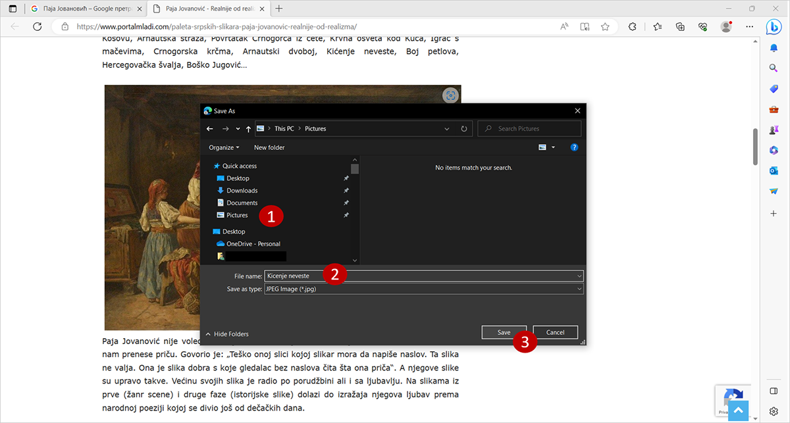
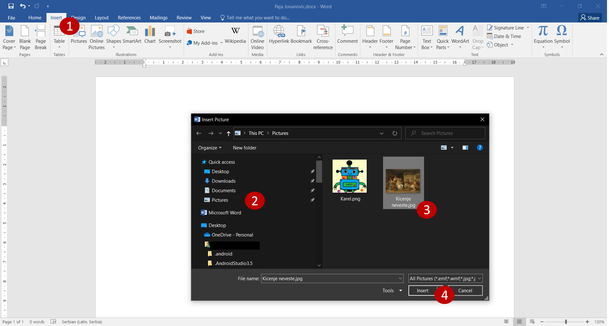
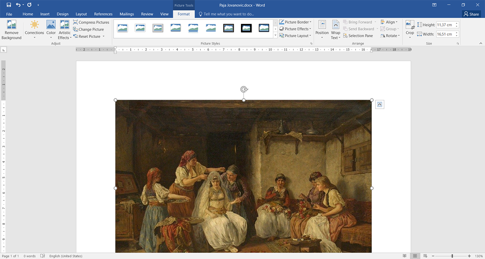
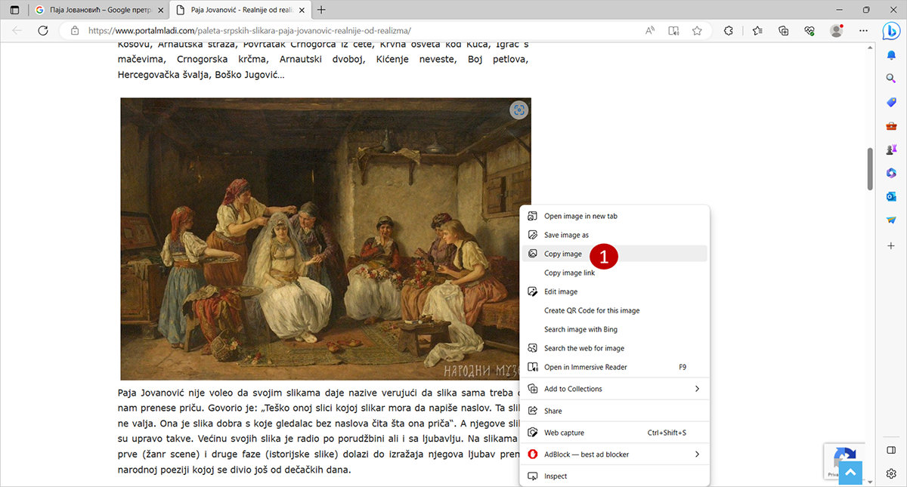

Kép letöltése az internetről
============================

Mivel a szöveg készen van, szükséged lesz a megfelelő képekre is!

Ha van lehetőség arra, hogy magad rajzolj valamit a Paint segítségével, az lesz a legjobb megoldás!

Ezúttal azonban egy olyan képre van szükségünk, amelyet Paja Jovanović festett, így azt az interneten fogjuk keresni.

A nyílra kattintva (1) térj vissza a keresés megkezdésének lépéséhez, vagy indítsd újra a Google keresőt.

A keresési kifejezések mezője alatt található gombok segítségével kiválaszthatod, hogy mit keresel. Kattints a *Képek* (2) gombra.

A keresés eredményeként Paja Jovanovićhoz kapcsolódó képek jelentek meg. Kattints bármelyikre közülük, és keresd fel azt az oldalt, amelyen található.

	
Ha el akarod menteni a képet a számítógépedre, hogy később felhasználhasd, kattints rá a jobb gombbal, melynek hatására megnyílik egy párbeszédablak az alábbi képen látható módon.

.. infonote::

 Egyes oldalak védett tartalommal rendelkeznek, így nem engedélyezett a képek letöltése, vagyis nincs ilyen lehetőséged!
 

	
A legjobb, ha a képet a *Pictures* (Képek) mappába mented. Keresd meg ezt a mappát a párbeszédablak bal oldalán (1).
Válaszd ki a nevet, amellyel el szeretnéd menteni a képet (2), és erősítsd meg a *Save* (Mentés) (3) gombra kattintva. 
A kép ugyanoda kerül mentésre, ahol a többi digitális rajzod is található.

Nyiss meg egy új Word dokumentumot, és mentsd el *Paja Jovanovic.docx* néven. Illeszd be a képet a dokumentumba úgy, 
ahogy azt Karel képével tetted, amikor arról tanultál, hogy miként kell ezt csinálni.

	

	
Kép másolása az internetről
~~~~~~~~~~~~~~~~~~~~~~~~~~~

Létezik egy másik, rövidebb és egyszerűbb módja annak, hogy képet illessz be az internetről a dokumentumodba – egyszerűen csak másold ki.

Kattints jobb gombbal arra a képre, amit másolni szeretnél, és válaszd a *Copy* (Másolás) (1) lehetőséget.

	
Nyisd meg a dokumentumot, amelybe be akarod illeszteni a képet, tedd a kurzort a kívánt helyre, és kattints a *Paste* (Beillesztés) gombra, 
vagy nyomd meg a **Ctrl + V** billentyűkombinációt. A kép bekerült a dokumentumba. Most már tetszés szerint szerkesztheted!

	
Most már ismered a projektfeladat létrehozásához szükséges összes eljárást. Válasszátok ki a témát, egyezzetek meg a projekt befejezési határidejéről, és határozzátok meg, hogyan értékelitek majd a feladat sikerességét (például tartalmazza-e a kulcsfontosságú információkat, ellenőrzött-e az információk pontossága, áttekinthető és érthető-e a dokumentum, a képek megfelelnek-e a tartalomnak...).

Kezdjétek el a kutatást… Sok sikert!

.. infonote::

 Идеја је да документ који направиш буде намењен твојим млађим другарима. Када правиш неки документ, води рачуна о томе ко треба да га прочита и
 прилагоди садржај текста који припремаш!

.. questionnote::

 Погледај како изгледају документа која су направили твоји другари. Шта би ти урадио другачије? Шта је добро у њиховим радовима? 
 Шта би променио у свом документу, чиме би га допунио?
