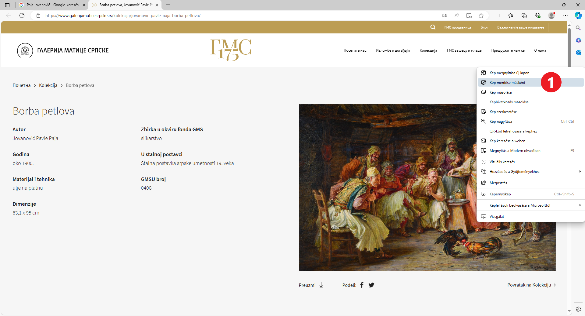
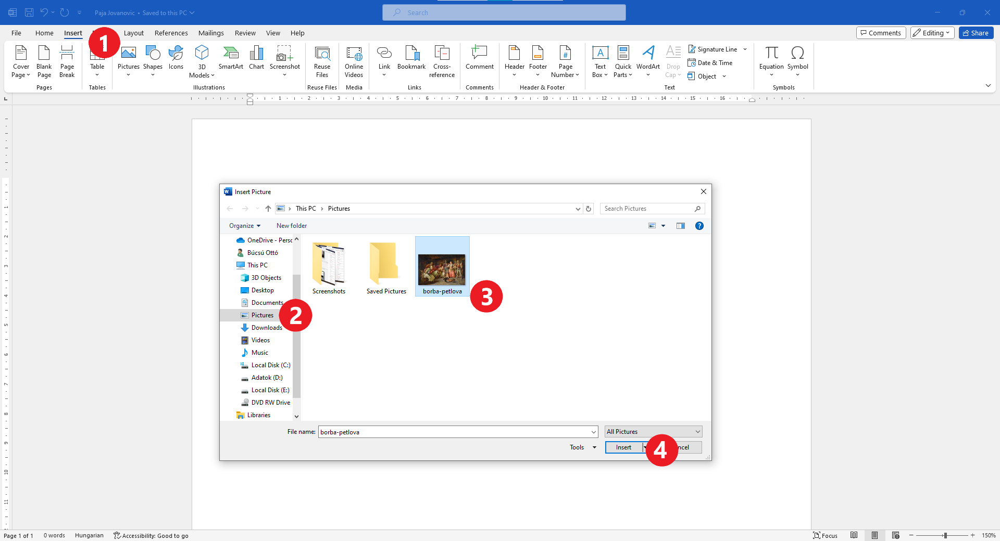

Kép letöltése az internetről
============================

Mivel a szöveg készen van, szükséged lesz a megfelelő képekre is!

Ha van lehetőség arra, hogy magad rajzolj valamit a Paint segítségével, az lesz a legjobb megoldás!

Ezúttal azonban egy olyan képre van szükségünk, amelyet Paja Jovanović festett, így azt az interneten fogjuk keresni.

A nyílra kattintva (1) térj vissza a keresés megkezdésének lépéséhez, vagy indítsd újra a Google keresőt.

A keresési kifejezések mezője alatt található gombok segítségével kiválaszthatod, hogy mit keresel. Kattints a *Képek* (2) gombra.

.. image:: ../../_images/pretraga_6.png
	:width: 800
	:align: center

Као резултат претраге појавиле су се слике повезане са Пајом Јовановићем. Кликни на било коју од њих и посети страницу на којој се 
налази.

	
Ако желиш да сачуваш слику на свом рачунару како би је касније употребио, кликни десним тастером на њу и отвориће се дијалог 
као на слици испод.

.. infonote::

 Неки сајтови имају заштићен садржај, па није дозвољено преузимање слика, тј. немаш ову могућност!
 
.. image:: ../../_images/pretraga_8.png
	:width: 800
	:align: center
	
Најбоље ће бити да слику снимиш у фасцикли *Pictures* (слике). Пронађи ову фасциклу у левом делу прозора дијалога (1). 
Изабери име под којим желиш да сачуваш слику (2) и потврди кликом на *Save* (3). Слика је сачувана на истом месту где 
су и твоји остали дигитални цртежи.

Отвори нови Ворд документ и сачувај га као *Paja Jovanovic.docx*. Уметни слику у документ као што си то урадио и са 
сликом Карела када си учио како се то ради. 

	
.. image:: ../../_images/pretraga_10.png
	:width: 800
	:align: center
	
Копирање слике са интернета
~~~~~~~~~~~~~~~~~~~~~~~~~~~

Постоји још један, краћи и једноставнији начин да уметнеш слику са интернета у свој документ – да је само ископираш.

Уради десни клик на слику коју желиш да копираш и изабери опцију *Copy* (1)

.. image:: ../../_images/pretraga_11.png
	:width: 800
	:align: center
	
Отвори документ у који желиш да је копираш, постави курсор на одабрано место и кликни *Paste* или притисни 
комбинацију **Ctrl + V** на тастатури. Слика је постављена у документ. Можеш да је уређујеш како желиш!

.. image:: ../../_images/pretraga_10.png
	:width: 800
	:align: center
	
Сада си упознат са свим техникама које су ти потребне за израду пројектног задатка. Изаберите тему, договорите се до када треба да завршите пројекат и на који начин 
ћете проценити колико сте добро урадили задатак (на пример: да ли су обухваћене кључне информације, да ли је проверена тачност информација, да ли је документ 
прегледан и разумљив, да ли слике у документу одговарају садржају...).

Отпочните истраживање… Срећно!

.. infonote::

 Идеја је да документ који направиш буде намењен твојим млађим другарима. Када правиш неки документ, води рачуна о томе ко треба да га прочита и
 прилагоди садржај текста који припремаш!

.. questionnote::

 Погледај како изгледају документа која су направили твоји другари. Шта би ти урадио другачије? Шта је добро у њиховим радовима? 
 Шта би променио у свом документу, чиме би га допунио?
