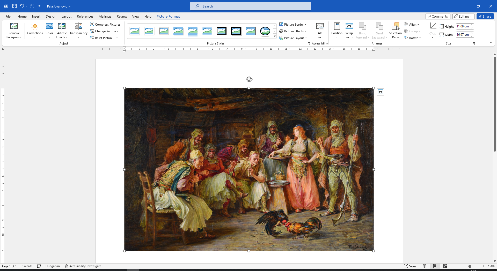

Kép letöltése az internetről
============================

Mivel a szöveg készen van, szükséged lesz a megfelelő képekre is.

Ha van lehetőség arra, hogy magad rajzolj valamit a Paint segítségével, az lesz a legjobb megoldás.

Ezúttal azonban egy olyan képre van szükségünk, amelyet Paja Jovanović festett, így azt az interneten fogjuk keresni.

A nyílra kattintva (1) térj vissza a keresés megkezdésének lépéséhez, vagy indítsd újra a Google keresőt!

A keresési kifejezések mezője alatt található gombok segítségével kiválaszthatod, hogy mit keresel. Kattints a *Képek* (2) gombra!

.. image:: ../../_images/pretraga_6.png
	:width: 800
	:align: center

A keresés eredményeként Paja Jovanovićhoz kapcsolódó képek jelentek meg. Kattints bármelyikre közülük, és keresd fel azt az oldalt, amelyen a releváns információ található!

.. image:: ../../_images/pretraga_7.png
	:width: 800
	:align: center
	
Ha el akarod menteni a képet a számítógépedre, hogy később felhasználhasd, kattints rá a jobb gombbal, melynek hatására megnyílik egy párbeszédablak az alábbi képen látható módon!

.. infonote::

 Egyes oldalak védett tartalommal rendelkeznek, így nem engedélyezett a képek letöltése, vagyis nincs ilyen lehetőséged.
 
.. image:: ../../_images/pretraga_8.png
	:width: 800
	:align: center
	
A legjobb, ha a képet a *Képek* (Pictures) mappába mented. Keresd meg ezt a mappát a párbeszédablak bal oldalán (1)!
Válaszd ki a nevet, amellyel el szeretnéd menteni a képet (2), és erősítsd meg a *Mentés* (Save) (3) gombra kattintva! 
A kép ugyanoda kerül mentésre, ahol a többi digitális rajzod is található.

Nyiss meg egy új Word-dokumentumot, és mentsd el *Paja Jovanovic.docx* néven! Illeszd be a képet a dokumentumba úgy, 
ahogyan azt Karel képével tetted, amikor arról tanultál, hogy miként kell ezt csinálni!

.. image:: ../../_images/pretraga_9.png
	:width: 800
	:align: center
	

	
Kép másolása az internetről
~~~~~~~~~~~~~~~~~~~~~~~~~~~

Létezik egy másik, rövidebb és egyszerűbb módja annak, hogy képet illessz be az internetről a dokumentumodba – egyszerűen csak másold ki!

Kattints jobb gombbal arra a képre, amit másolni szeretnél, és válaszd a *Copy image* (Kép másolása) (1) lehetőséget!

.. image:: ../../_images/pretraga_11.png
	:width: 800
	:align: center
	
Nyisd meg a dokumentumot, amelybe be akarod illeszteni a képet, tedd a kurzort a kívánt helyre, és kattints a *Paste* (Beillesztés) gombra, 
vagy nyomd meg a **Ctrl + V** billentyűkombinációt! A kép bekerült a dokumentumba. Most már tetszés szerint szerkesztheted!

	
Most már ismered a projektfeladat létrehozásához szükséges összes eljárást. Válasszátok ki a témát, egyezzetek meg a projekt befejezési határidejéről, és határozzátok meg, hogyan értékelitek majd a feladat sikerességét (például tartalmazza-e a kulcsfontosságú információkat, ellenőrzött-e az információk pontossága, áttekinthető és érthető-e a dokumentum, a képek megfelelnek-e a tartalomnak...).

Kezdjétek el a kutatást! Sok sikert!

.. infonote::

 A projektfeladat készüljön a fiatalabb barátaidnak! Amikor valamilyen dokumentumot készítesz, 
 ügyelj arra, hogy ki lesz az olvasója, és ehhez igazodjon a szöveg tartalma is!

.. questionnote::

 Nézd meg, hogyan néznek ki a barátaid által készített dokumentumok! Mit csinálnál másképp? Mi az, ami jó az ő munkáikban? 
 Mit változtatnál meg a saját dokumentumodban, mivel egészítenéd ki?
