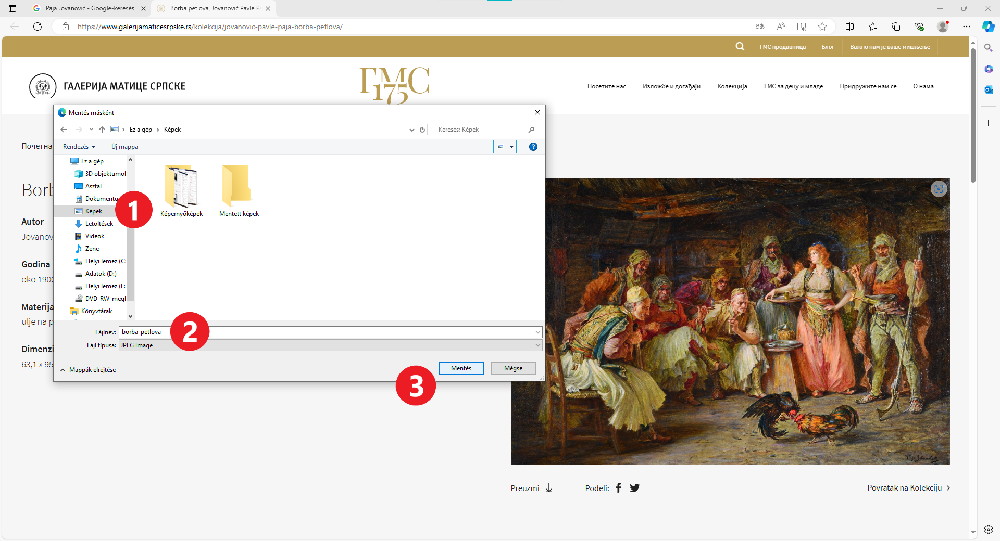
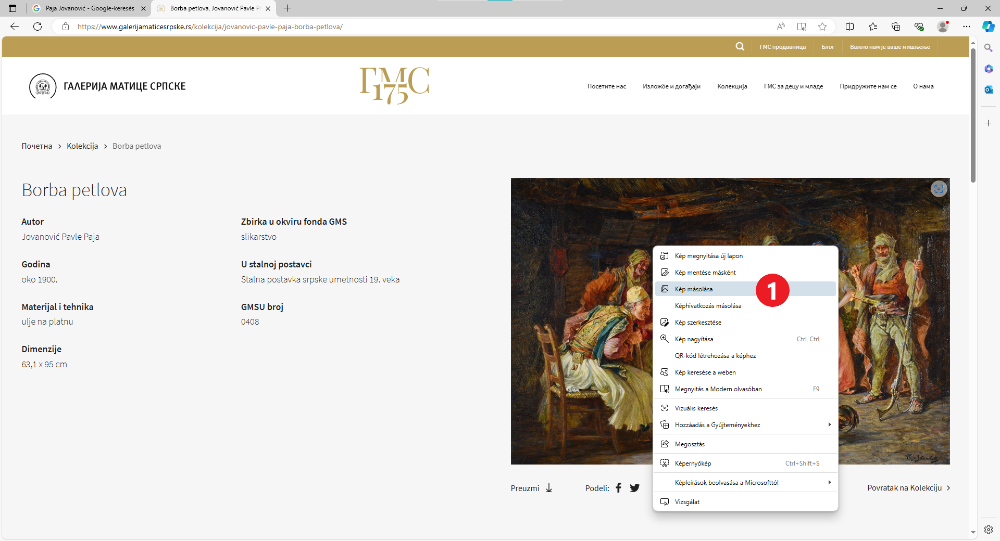

Kép letöltése az internetről
============================

Mivel a szöveg készen van, szükséged lesz a megfelelő képekre is!

Ha van lehetőség arra, hogy magad rajzolj valamit a Paint segítségével, az lesz a legjobb megoldás!

Ezúttal azonban egy olyan képre van szükségünk, amelyet Paja Jovanović festett, így azt az interneten fogjuk keresni.

A nyílra kattintva (1) térj vissza a keresés megkezdésének lépéséhez, vagy indítsd újra a Google keresőt.

A keresési kifejezések mezője alatt található gombok segítségével kiválaszthatod, hogy mit keresel. Kattints a *Képek* (2) gombra.

A keresés eredményeként Paja Jovanovićhoz kapcsolódó képek jelentek meg. Kattints bármelyikre közülük, és keresd fel azt az oldalt, amelyen található.

.. image:: ../../_images/pretraga_7.png
	:width: 800
	:align: center
	
Ha el akarod menteni a képet a számítógépedre, hogy később felhasználhasd, kattints rá a jobb gombbal, melynek hatására megnyílik egy párbeszédablak az alábbi képen látható módon.

.. infonote::

 Egyes oldalak védett tartalommal rendelkeznek, így nem engedélyezett a képek letöltése, vagyis nincs ilyen lehetőséged!
 

	
A legjobb, ha a képet a *Pictures* (Képek) mappába mented. Keresd meg ezt a mappát a párbeszédablak bal oldalán (1).
Válaszd ki a nevet, amellyel el szeretnéd menteni a képet (2), és erősítsd meg a *Save* (Mentés) (3) gombra kattintva. 
A kép ugyanoda kerül mentésre, ahol a többi digitális rajzod is található.

Nyiss meg egy új Word dokumentumot, és mentsd el *Paja Jovanovic.docx* néven. Illeszd be a képet a dokumentumba úgy, 
ahogy azt Karel képével tetted, amikor arról tanultál, hogy miként kell ezt csinálni.

.. image:: ../../_images/pretraga_9.png
	:width: 800
	:align: center
	
.. image:: ../../_images/pretraga_10.png
	:width: 800
	:align: center
	
Копирање слике са интернета
~~~~~~~~~~~~~~~~~~~~~~~~~~~

Постоји још један, краћи и једноставнији начин да уметнеш слику са интернета у свој документ – да је само ископираш.

Уради десни клик на слику коју желиш да копираш и изабери опцију *Copy* (1)

	
Отвори документ у који желиш да је копираш, постави курсор на одабрано место и кликни *Paste* или притисни 
комбинацију **Ctrl + V** на тастатури. Слика је постављена у документ. Можеш да је уређујеш како желиш!

.. image:: ../../_images/pretraga_10.png
	:width: 800
	:align: center
	
Сада си упознат са свим техникама које су ти потребне за израду пројектног задатка. Изаберите тему, договорите се до када треба да завршите пројекат и на који начин 
ћете проценити колико сте добро урадили задатак (на пример: да ли су обухваћене кључне информације, да ли је проверена тачност информација, да ли је документ 
прегледан и разумљив, да ли слике у документу одговарају садржају...).

Отпочните истраживање… Срећно!

.. infonote::

 Идеја је да документ који направиш буде намењен твојим млађим другарима. Када правиш неки документ, води рачуна о томе ко треба да га прочита и
 прилагоди садржај текста који припремаш!

.. questionnote::

 Погледај како изгледају документа која су направили твоји другари. Шта би ти урадио другачије? Шта је добро у њиховим радовима? 
 Шта би променио у свом документу, чиме би га допунио?
