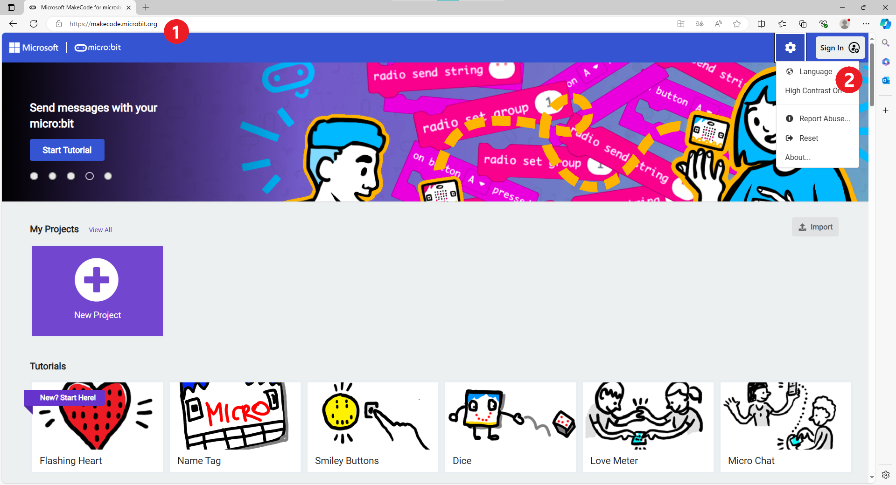
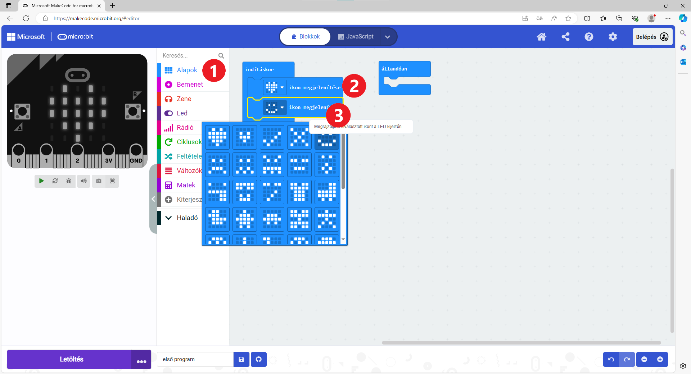

Lineáris programok
==================

Már teljesen világos, hogy az alapvető algoritmikus struktúrákkal a mindennapi életben is találkozhatsz.

Ahogy Karel robotnál is felhasználtad őket a feladatok végrehajtásában, ugyanúgy alkalmazhatod a microbit programozásában is.

Ahhoz, hogy felelevenítsd magadban a microbit programozását, oldd meg a következő feladatot:

1. példa
~~~~~~~~

Állítsd össze az utasítás blokkokat úgy, hogy a microbit megjelenítse egy szív képet, egy boldog emotikont, majd a nevedet.

Bár ezt már tavaly is csináltad, ismételjük át az első lépéseket. Minden feladat megoldásának folyamata hasonló, jól jegyezd meg!

A böngésző címsorába írd be a következő címet: https://makecode.microbit.org (1). Ennek hatására be fog töltődni a microbit programozási környezet.

Ha nincs beállítva, állítsd a környezetet magyar nyelvűre. Ehhez kattints a kis fogaskerékre az ablak jobb felső sarkában, majd a *Language* (Nyelv) (2) gombra, ahogy az alábbi képen látható.

	
Keresd meg a *Magyar* feliratú gombot, és kattints rá. A programozói környezetet most magyar nyelvűre változott.
Ez nagyban megkönnyíti a további munkád!

|

Készítsd el az első programod! Kattintson az *Új projekt* elemre (1), adj nevet a projektnek (2), majd kattints a *Létrehoz* gombra (3).

.. image:: ../../_images/mb2.png
	:width: 800
	:align: center
	
A programozói környezet az első programodhoz készen áll, elkezdheted összeállítani a blokkokat!

|

Блокови су смештени у различите групе (1). Сви блокови једне групе имају исту боју. Када кликнеш на назив групе, 
појавиће се блокови који се у њој налазе. И у овом окружењу програм састављаш тако што мишем превлачиш блокове 
које желиш у простор који се налази са десне стране (2).

Када покренеш пројекат, видећеш да су већ постављена два блока: ``почетак`` и ``стално понављај``. Све што ставиш унутар 
блока ``почетак`` биће урађено само једном. Блок стално ``понављај`` омогућава да се све наредбе које се у њему налазе 
понављају све док је микробит укључен.

Хајде да се вратимо на текст задатка. Потражи у којој се групи налазе блокови које би могао да употребиш за своје 
решење. Помоћи ћемо ти! 

Прати слику испод. Кликни на групу *Основни блокови* (1). У њој се налазе блокови које ћеш користити – ``прикажи икону`` (2) и ``прикажи текст``. 

Пошто је у тексту задатка речено да се само једном прикажу ове сличице и текст, превуци ове блокове у блок ``почетак``, 
као што је урађено на слици испод. 

Када кликнеш на стрелицу поред сличице (иконе) (3), појавиће се и друге опције. Изабери насмејан емотикон.

Испод овог блока постави блок прикажи текст из исте групе и промени текст који треба да буде приказан – напиши своје име!

.. infonote::

 Текст на микробиту може да буде написан само латиничким писмом без додатака за š, ć, č, đ (осим ако не пишеш сам слово по слово тако да буде исписано ћирилицом или са додацима).

Блок ``стално понављај`` је у овом случају вишак, тако да можеш да га избришеш (десни клик на блок, *Брисање блока*).
		
.. image:: ../../_images/mb4.png
	:width: 800
	:align: center

Твој први програм је састављен!

.. questionnote::

 Како можеш да провериш да ли си добро урадио задатак? 

На левој страни се налази слика микробита. Помоћу ње можеш да провериш како се извршава твој програм (ако немаш код себе прави уређај). 
Кликни на дугменце са троуглом и посматрај шта се дешава. Да ли програм ради онако како си замислио?

Пробај да убациш и остале блокове из групе основни блокови. Нацртај своју икону помоћу блока прикажи диоде. Убаци блок 
обриши екран. Сваки пут кад направиш неку измену, покрени симулатор и посматрај шта се приказује на екрану микробита.

Пример 2
~~~~~~~~

.. image:: ../../_images/mb6.png
	:width: 800
	:align: center

Зока је одлучила да поређа блокове тако да направи анимацију бродића који се креће. Почела је да слаже блокове, 
али се мало збунила. 

.. questionnote::

 Да ли је свеједно којим ће редом поређати преостале блокове?

.. quizq::

   .. mchoice:: p621
        :correct: b
        :answer_a: 1-2-3-4-5-6
        :answer_b: 4-2-1-5-3-6
        :answer_c: 5-1-2-4-3-6
        :answer_d: 3-5-1-4-2-6
        :feedback_a: Одговор није тачан. 
        :feedback_b: Одговор је тачан. 
        :feedback_c: Одговор није тачан. 
        :feedback_d: Одговор није тачан.

        Означи исправан редослед блокова како би се на екрану видео бродић који плови:
		
Пример 3
~~~~~~~~

У првом примеру твоје име је било написано само једном. А шта ако желиш да се стално појављује на екрану? Уместо блока почетак употреби блок стално понављај. Покрени симулацију. 

.. questionnote::

 Колико ће пута бити исписано твоје име? Да ли можеш унапред то да знаш?
 
Замени блок ``почетак`` блоком ``стално понављај`` и у Примеру 2. Да ли се бродић поново појавио на екрану?
