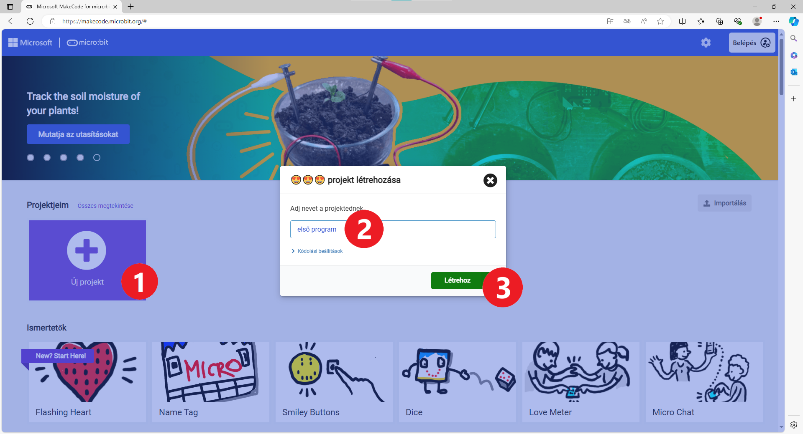
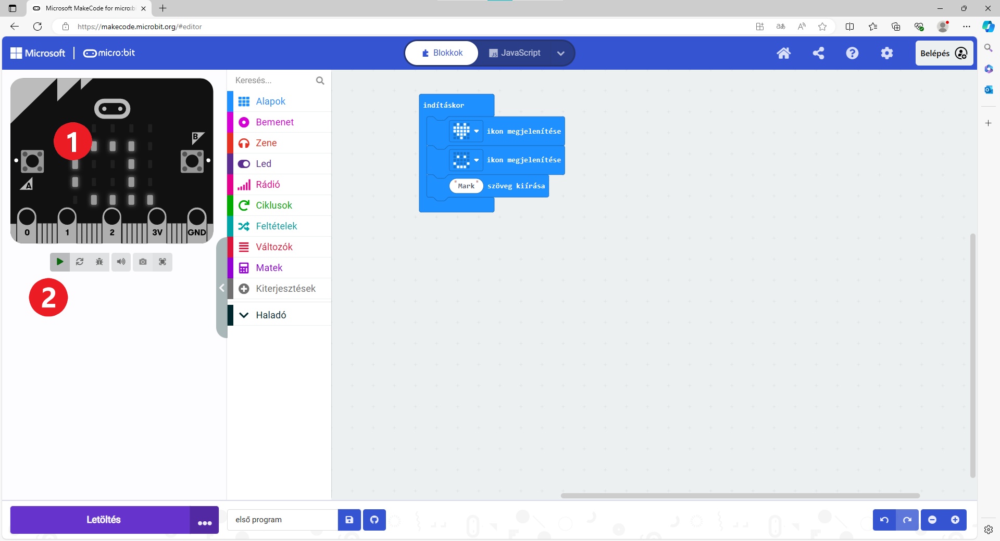
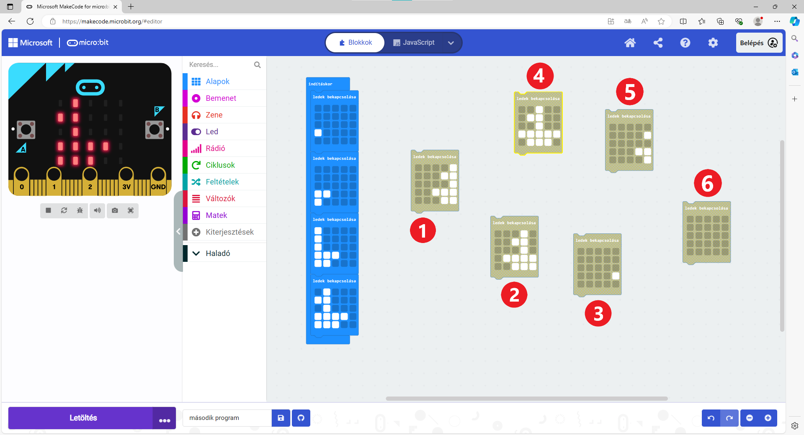

Lineáris programok
==================

Már teljesen világos, hogy az alapvető algoritmikus struktúrákkal a mindennapi életben is találkozhatsz.

Ahogy Karel robotnál is felhasználtad őket a feladatok végrehajtásában, ugyanúgy alkalmazhatod a microbit programozásában is.

Ahhoz, hogy felelevenítsd magadban a microbit programozását, oldd meg a következő feladatot:

1. példa
~~~~~~~~

Állítsd össze az utasítás blokkokat úgy, hogy a microbit megjelenítsen egy szívet ábrázoló képet, egy boldog emotikont, majd a nevedet!

Bár ezt már tavaly is csináltad, ismételjük át az első lépéseket! Minden feladat megoldásának folyamata hasonló, jól jegyezd meg!

A böngésző címsorába írd be a következő címet: https://makecode.microbit.org (1)! Ekkor be fog töltődni a microbit programozási környezet.

Ha nincs beállítva, állítsd a környezetet magyar nyelvűre! Ehhez kattints a kis fogaskerékre az ablak jobb felső sarkában, majd a *Language* (Nyelv) (2) gombra, ahogy az alábbi képen látható!

.. image:: ../../_images/mb1.png
	:width: 800
	:align: center
	
Keresd meg a *Magyar* feliratú gombot, és kattints rá! A programozói környezet most magyar nyelvűre változott.
Ez nagyban megkönnyíti a további munkád.

|

Készítsd el az első programod! Kattintson az *Új projekt* elemre (1), adj nevet a projektnek (2), majd kattints a *Létrehoz* gombra (3)!

	
A programozói környezet készen áll az első programodhoz, elkezdheted összeállítani a blokkokat!

|

A blokkok különböző csoportokba vannak rendezve (1). Az egy csoportba tartozó blokkok ugyanolyan színűek.
Amikor rákattintasz egy csoport nevére, megjelennek az abban található blokkok. 
Ebben a környezetben is úgy állítod össze a programot, hogy egérrel áthúzod a kívánt blokkokat a jobb oldalon található területre (2).

.. image:: ../../_images/mb2a.png
	:width: 800
	:align: center

Amikor elindítod a projektet, látni fogod, hogy már két blokk rögtön be van állítva: az ``indításkor`` és az ``állandóan``. 
Minden, amit az ``indításkor`` blokkon belül elhelyezel, csak egyszer fog végrehajtódni. Az ``állandóan`` blokk lehetővé teszi, hogy az abban található utasítások addig ismétlődjenek, amíg a microbit be van kapcsolva.

Térjünk vissza a feladat szövegéhez. Keresd meg, melyik csoportban találhatók azok a blokkok, amelyeket a megoldásodhoz használhatnál! Segítünk.

Kövesd az alábbi képet! Kattints az *Alapok* (1) csoportra! Ebben találhatók azok a blokkok, amelyeket most használni fogsz – 
az ``ikon megjelenítése`` (2) és a ``szöveg kiírása``.

Mivel a feladat szövegében az szerepel, hogy ezek a képek és szövegek csak egyszer jelenjenek meg, húzd ezeket a blokkokat az ``indításkor`` blokkba, 
ahogy az az alábbi képen is látható!

.. image:: ../../_images/mb3.png
	:width: 800
	:align: center

Amikor rákattintasz a kép (ikon) melletti nyílra (3), további lehetőségek jelennek meg. Válaszd ki a mosolygó emotikont!

Az ikon megjelenítése blokk alá helyezd el a szöveg megjelenítése blokkot ugyanabból a csoportból, és változtasd meg a megjelenítendő szöveget – írd be a nevedet!

.. infonote::

 A microbit kijelzőjén a szöveg csak latin betűkkel jeleníthető meg, ékezetek nélkül (kivéve, ha egyesével íratod ki a saját magad által létrehozott betűket).

Az ``állandóan`` blokk ebben az esetben felesleges, így az törölhető (jobb egérgomb kattintás a blokkon, majd a *Blokk törlése* menüelem kiválasztása).
		

Ezzel el is készült az első programod.

.. questionnote::

 Hogyan tudod leellenőrizni, hogy jól oldottad-e meg a feladatot?

A bal oldalon láthatod a microbit képét. Ezzel ellenőrizheted, hogyan fut a programod (ha nincs nálad valódi eszköz).
Kattints a háromszög gombra, és figyeld, mi történik! A program úgy működik, ahogy elképzelted?

Próbáld meg beilleszteni a többi blokkot is az Alapok csoportjából. Rajzolj saját ikont a ledek bekapcsolása nevű blokkal! Illeszd be a kijelző letörlése blokkot is! 
Minden alkalommal, amikor változtatsz valamit, futtasd a szimulátort, és figyeld, mi jelenik meg a microbit kijelzőjén!

2. példa
~~~~~~~~

Zita szerette volna a blokkokat elrendezni, hogy azok egy mozgó hajót jelenítsenek meg. Elkezdte összeállítani a blokkokat, de kicsit összezavarodott.
 

.. questionnote::

 Számít-e az, hogy milyen sorrendben rendezzük el a megmaradt blokkokat?

.. quizq::

   .. mchoice:: p621
        :correct: b
        :answer_a: 1-2-3-4-5-6
        :answer_b: 4-2-1-5-3-6
        :answer_c: 5-1-2-4-3-6
        :answer_d: 3-5-1-4-2-6
        :feedback_a: A válasz nem helyes. 
        :feedback_b: A válasz helyes. 
        :feedback_c: A válasz nem helyes.  
        :feedback_d: A válasz nem helyes. 

        Jelöld meg a blokkok helyes sorrendjét úgy, hogy a kijelző egy úszó hajót jelenítsen meg:
		
3. példa
~~~~~~~~

Az első példában a neved csak egyszer volt kiíratva. És mi van akkor, ha azt szeretnéd, hogy az folyamatosan megjelenjen a kijelzőn? Az indításkor blokk helyett használd az állandóan nevű blokkot! Futtasd le a szimulációt! 

.. questionnote::

 Hányszor lesz kiírva a neved? Meg lehet ezt előre mondani?
 
A 2. példában is cseréld le az ``indításkor`` blokkot az ``állandóan`` nevű blokkra! Megjelent-e újra a kis hajó a kijelzőn? 
