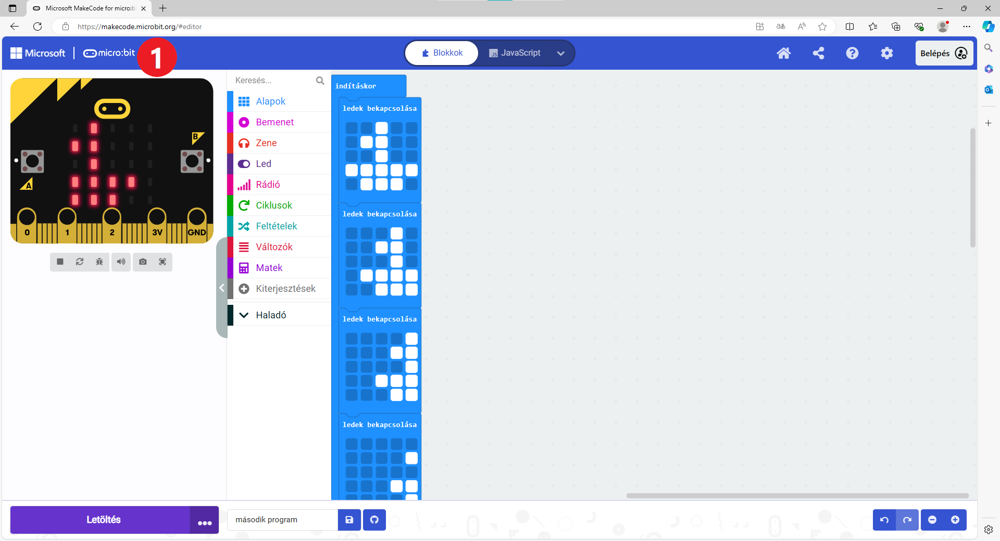
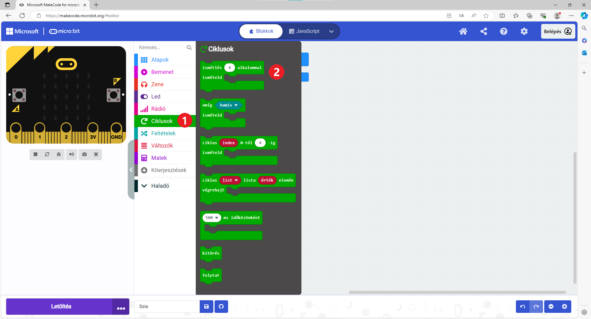
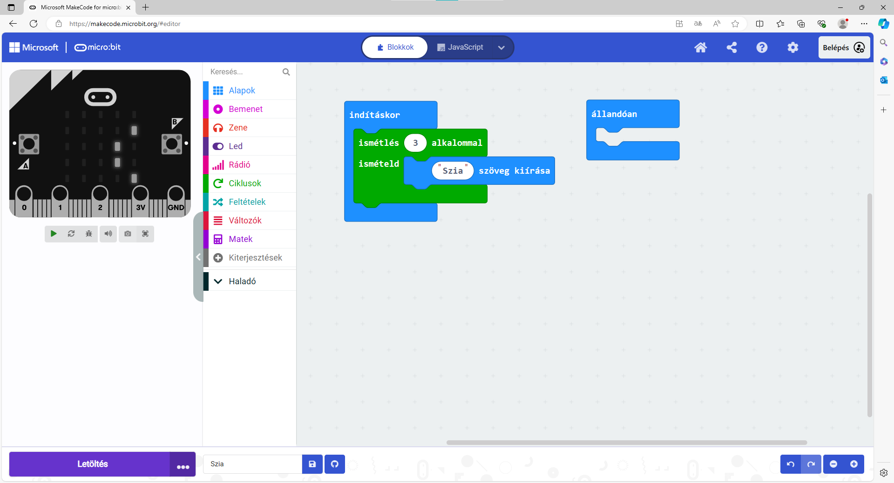
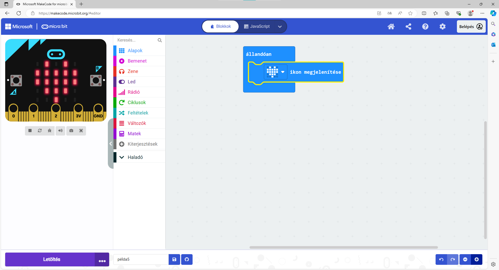

Ismétlődő programok
===================

.. infonote::

 Amikor a ``állandóan`` nevű blokkot használod, a benne lévő parancsok mindaddig végrehajtásra kerülnek, amíg a microbit be van kapcsolva.

Emlékezz vissza Karelre! Gyakran adtál neki olyan parancsokat, amelyeket meghatározott számú alkalommal kellett megismételni. Hogyan lehet ezt megvalósítani a microbitt esetében?

4. példa
~~~~~~~~

Állítsd össze a blokkokat úgy, hogy a „Hello“ szöveg csak háromszor jelenjen meg a kijelzőn! 

Kattints a mikrobit ikonra (1), hogy visszatérj a projekteket tartalmazó ablakhoz.

Hozz létre egy projektet, a neve pedig legyen „Hello“.
Amikor egy utasítást vagy az utasítások csoportját többször meg kell ismételni, akkor a programban ciklusokat használunk.

Ez már ismerősen hangzik, ugye?

Kattints a *Ciklusok* csoportra (amely zöld színű). Превуци блок ``понови _ пута`` у простор за слагање блокова. 

Пошто у задатку стоји да се текст понови три пута, уместо броја 4 упиши број 3. У овај блок додај блок за приказ текста „Zdravo“. 

Твој програм сада изгледа овако:

	
Покрени симулацију!

.. questionnote::

 Шта ће се десити ако уместо блока почетак употребиш блок стално понављај?

Пример 5
~~~~~~~~

Мара је добила задатак да састави програм који приказује срце како куца. Њено решење је следеће: 

у блок ``стално понављај`` уклопила је блок ``прикажи икону (срце)``. 

	
.. questionnote::

 Да ли је Мара добро урадила задатак? Да ли се види како срце „куца“ (појављује се и нестаје) или само стоји на екрану? 
 
 Због чега? Који блок треба да дода да би микробит приказивао оно што је речено у задатку?
 
Постави блокове тако да срце буде приказано пола секунде, па да екран буде празан пола секунде и тако наизменично, све док је укључен микробит уређај.

.. reveal::  Срце - решење
   :showtitle: Предлог решења   
   :hidetitle: Затвори
	
   Предлог решења
 
   .. image:: ../../_images/mb5.png
     :width: 800
     :align: center
	
   |

Погледај доњи десни угао прозора. Да ли можеш да претпоставиш чему служе ова дугменца?

Прва два ти омогућавају да се вратиш корак назад или пролазиш кроз кораке до последњег направљеног (1), а дугменца 
означена са бројем (2) ти омогућавају да увећаваш/смањујеш блокове ради боље прегледности. 

Присети се како се то ради у Ворду!
	
