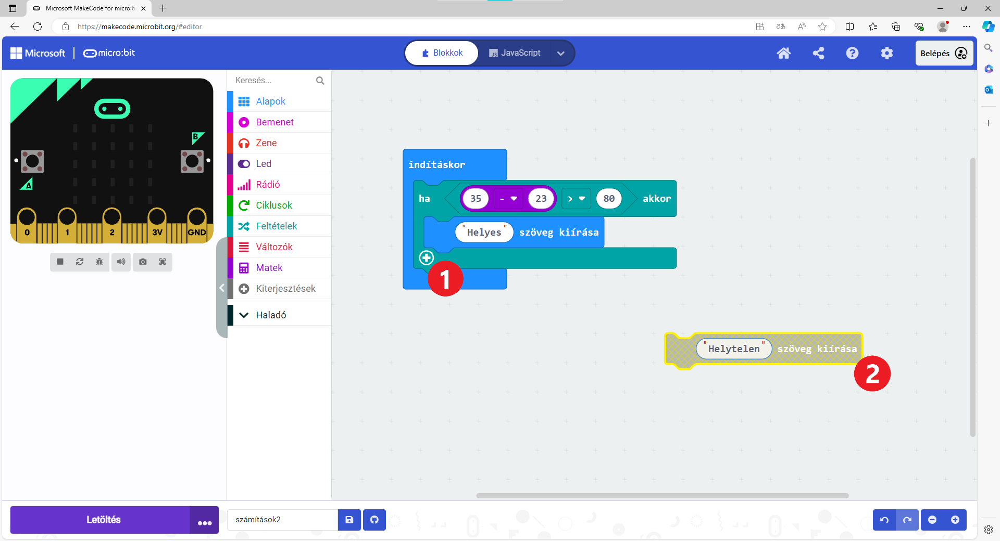
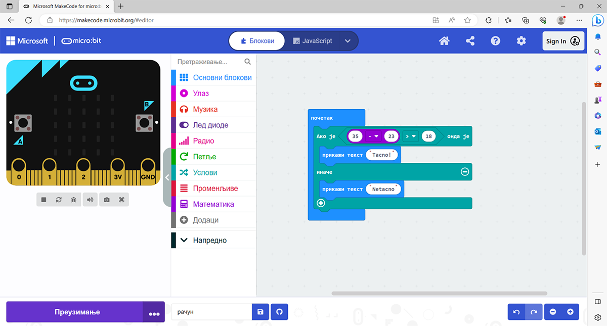

Програми са гранањем
====================

У зависности од неког резултата који добијеш или да ли је испуњен неки услов, програм може да извршава различите наредбе.
 
Ево најједноставнијег примера – унесеш математички израз и микробит испише да ли је тачан или не.

Пример 7
~~~~~~~~

Марко треба да провери решење задатка из математике. Он мисли да је 35 - 23 > 18. Одлучио је да то препусти микробиту. 

На симулатору је саставио блокове – микробит треба да испише „Tacno“ ако је решење исправно, или „Netacno“ aко је погрешио. 

   .. image:: ../../_images/mb15.png
     :width: 800
     :align: center
	 
Састави блокове као Марко. Неки од блокова који су ти потребни налазе се у групи *Услови*.

.. questionnote::

 Без покретања симулације одговори на питање – шта ће бити исписано на микробиту када се покрене Марков програм?
 
Покрени сада симулацију! Да ли се нешто приказује на екрану? Шта би требало да буде приказано?

Иако је нама логично да ће микробит да испише „Netacno“, њему то нико није рекао! 

.. infonote::

 Када састављаш програм, обавезно узми у обзир све могуће ситуације!

	
Кликни на знак плус (1) и добићеш проширен блок (слика изнад). Допуни програм – реци микробиту шта треба да ради ако 
услов није испуњен (2), односно ако је резултат нетачан.

	
