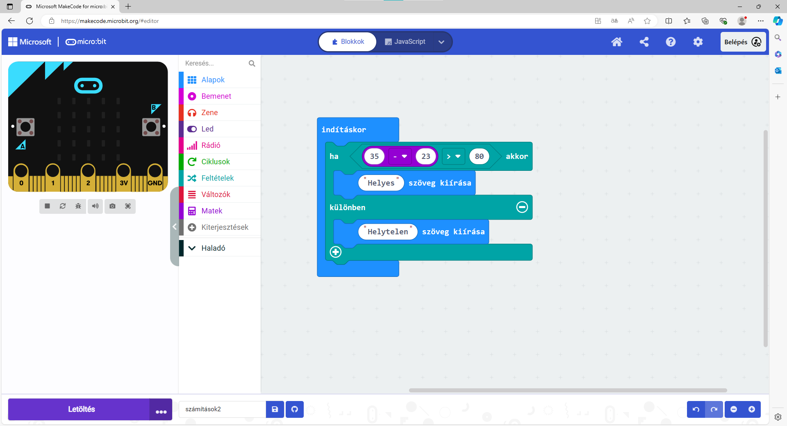

Elágazó programok
=================

A kapott eredménytől vagy egy feltétel teljesülésétől függően a program különböző parancsokat hajthat végre.
 
Például beírsz egy matematikai kifejezést, és a microbit kiírja, hogy helyes-e vagy sem.

7. példa
~~~~~~~~

Márknak ellenőriznie kell egy matematikai feladat megoldását. Szerinte 35 - 23 > 18. Eldöntötte, hogy ezt a microbitre bízza.

A szimulátoron összeállította a blokkokat – a microbitnek pedig ki kell írnia, hogy „Helyes”, ha a megoldás helyes, illetve hogy „Helytelen”, ha tévedett.

   .. image:: ../../_images/mb15.png
     :width: 800
     :align: center
	 
Állítsd össze a blokkokat úgy, ahogy Márk csinálta. Néhány blokkot majd a *Feltételek* csoportban fogsz megtalálni.

.. questionnote::

 A szimuláció futtatása nélkül válaszolj a kérdésre: mit fog kiírni a microbit Márk programjának futtatásakor?
 
Indítsd el most a szimulációt! Megjelenik valami a képernyőn? Mi kellene, hogy megjelenjen?

Bár számunkra logikus, hogy a microbit a „Helytelen” szót kellene, hogy kiírja, neki ezt senki sem mondta meg!

.. infonote::

 A program összeállításakor mindenképpen vegyél figyelembe minden lehetséges helyzetet!

.. image:: ../../_images/mb16.png
	:width: 800
	:align: center
	
Kattints a plusz jelre (1), melynek hatására egy kibővített blokkot kapsz (lásd a fenti képet). Egészítsd ki a programot – mondd meg a microbitnek,
hogy mit kell tennie, ha a feltétel nem teljesül (2), vagyis ha az eredmény helytelen.

	
