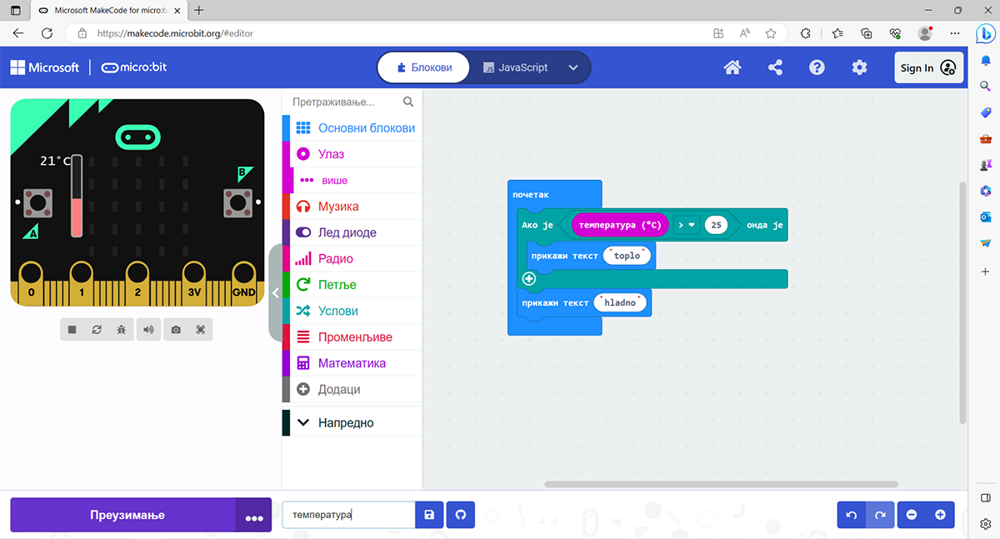
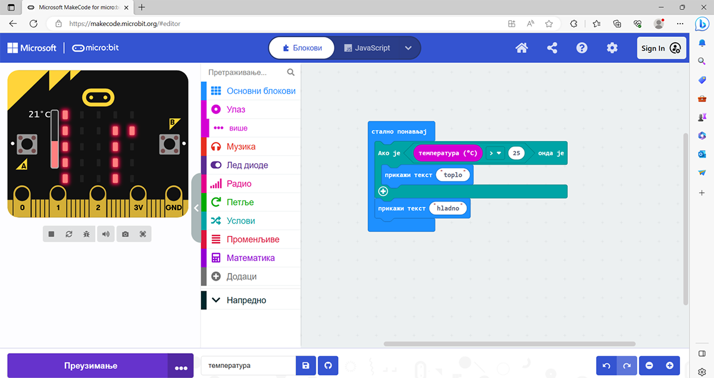
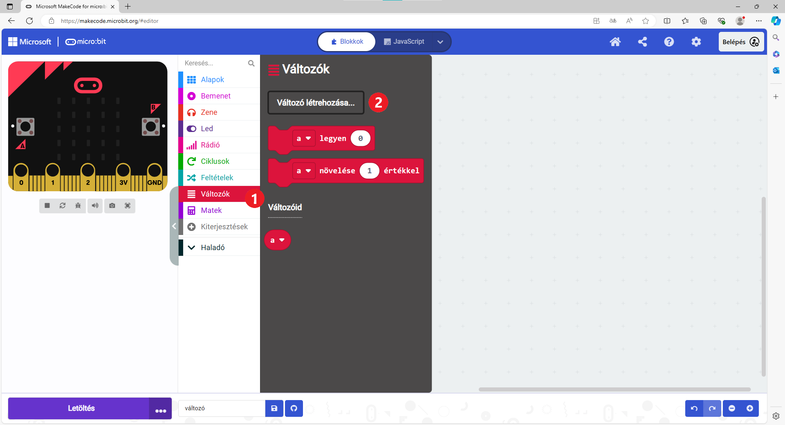
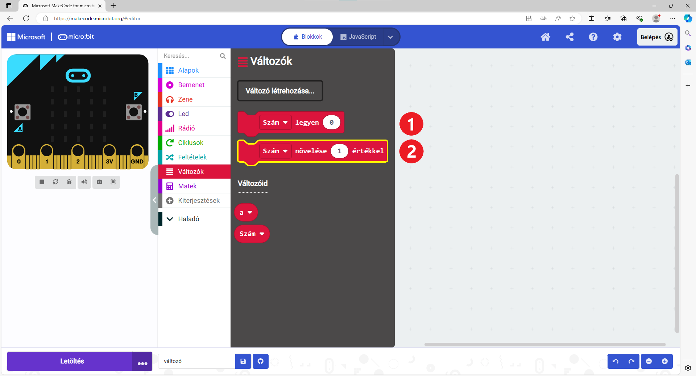
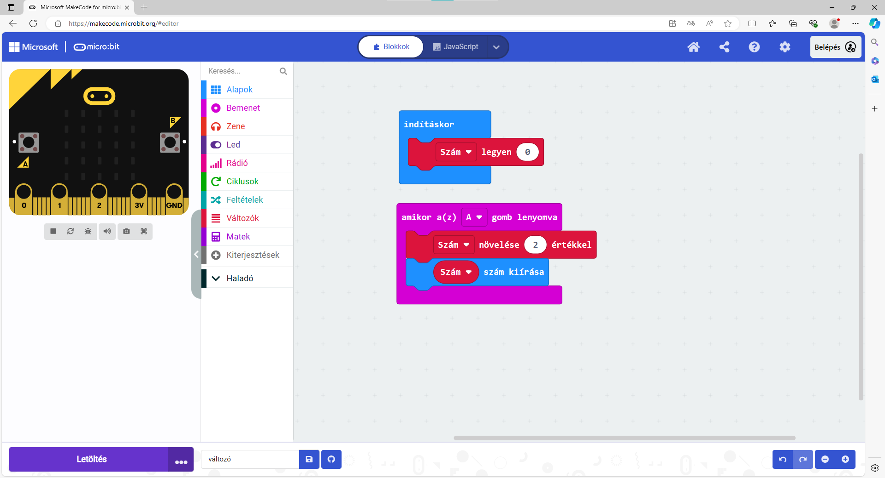
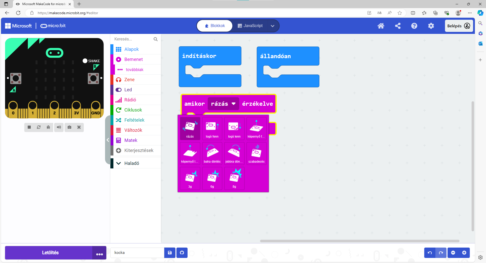
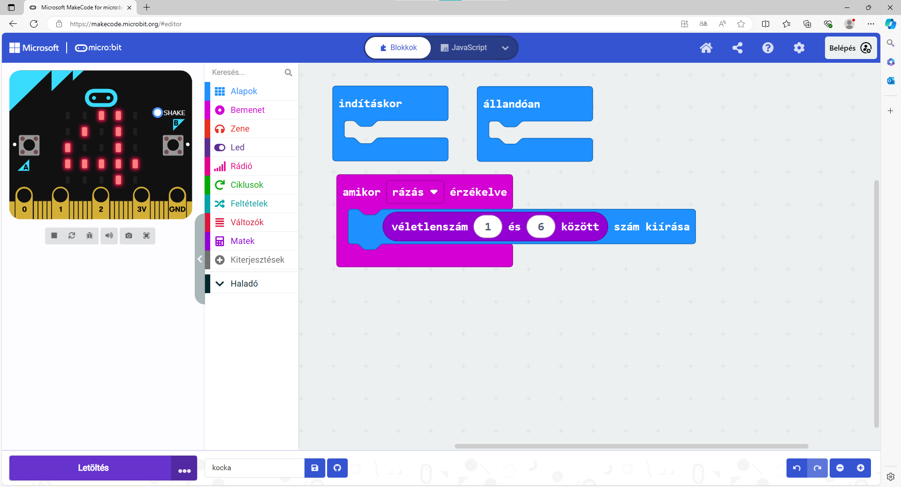

Változó értékek
===============

Az előző példában a microbit különböző parancsokat hajtott végre egy matematikai kifejezés alapján, amely mindig ugyanazt adja eredményül. 
Ebben az esetben a program minden egyes futtatásakor a microbit a „Helytelen“ szót fogja kiírni.

Azonban legtöbb esetben a programban feltételként szereplő kifejezések változó értékekűek lehetnek. 
Egy egyszerű példa: a felhasználó beír egy számot, és ha az osztható kettővel, a program a „Páros“ szót írja ki, ellenkező esetben „Páratlan“ szót.

**A felhasználó által beírt értékek változók, ezért a microbit által kiírt értékek is ennek megfelelően változnak.**

.. questionnote::

 Említettük, hogy a microbit képes megmérni a hőmérsékletet. Vajon a hőmérséklet mindig ugyanaz, vagy változik?
 
Ebben a programozói környezetben a Bemenet csoportban egy „hőmérséklet (°C)“ blokk is található, amelyet felhasználhatsz a programodban is egy konkrét szám helyett. 
Ebben a blokkban a pillanatnyi hőmérséklet tárolódik, ami a program futása során különböző értékeket vehet fel.

Nézzük meg, hogyan használhatod ezt a blokkot...

8. példa
~~~~~~~~

Készíts egy programot, amely a microbit környezetének hőmérsékletétől függően a képernyőn „meleg” vagy „hideg” szót jelenít meg.

Rendezd el a blokkokat az alábbi képen látható módon:

	
A microbit csak egyszer mérte meg a hőmérsékletet, és kiírta, hogy „meleg” (a szimulátoron a hőmérőt 36 fokra állítottuk).
És ennyi... De mi van, ha időközben megváltozik a hőmérséklet? Hol hibáztunk?

Logikus, hogy a microbitnek folyamatosan kellene, hogy mérje a hőmérsékletet és ellenőrizze, hogy meleg vagy hideg van-e.

Milyen blokkot kellene alkalmaznunk a ``indításkor`` blokk helyett?

Nézd meg, hogyan néz ki az a program, amely megoldja ezt a problémát:

.. questionnote::

 Nyisd meg a *Bemenet* csoportot, és nézd meg, milyen egyéb blokkok vannak, amelyek változó értékkel rendelkeznek.
 Hogyan tudnád felhasználni ezeket valamelyik programodban? 

A meglévő blokkokon kívül, amelyek változó értékeket használnak (hőmérséklet, fényerősség stb.), saját blokkokat is készíthetsz. 
Kitalálhatsz egy nevet a változó értékhez, és használhatod ezt a blokkot a programodban.

9. példa
~~~~~~~~

Ez a feladat egy kissé eltér az eddigiektől. A képernyőn egy számnak kell megjelennie. Minden alkalommal, amikor megnyomod az **A** gombot, a számnak 2-vel kell növekednie. A program elindulásakor a számnak nullának kell lennie.

Olvasd el még egyszer a feladatot. Mit is kell valójában tenned? A **számnak** meg kell jelennie, amikor megnyomod a gombot.
A szám mindig ugyanaz? Nem. A **szám** minden alkalommal változik, vagyis egy változó.

Hozzunk létre egy Szám nevű változót, és minden alkalommal, amikor megnyomod a gombot, változtassuk meg az értékét majd jelenítsük meg.

.. questionnote::

 A feladat szövege alapján, mivel egyenlő a **Szám** változó kezdőértéke? Mennyivel kell minden alkalommal változtatni az értékét?

Hogyan hozzunk létre egy blokkot a változó értékhez?

Kattints a Változók (1) csoportra, majd a Változó létrehozása... (2) gombra. Írd be a változó nevét a megjelenő ablakba.
Legyen a neve **Szám**.

	
Nézd meg az alábbi képet. A változók között megjelent a saját változód is. Mostantól különböző értékeket tárolhatsz benne – 
hozzáadhatsz számokat, megszorozhatod egy számmal, összehasonlíthatod stb., vagy használhatod, mint egy blokkot bármely más számmal.

.. questionnote::

 
 Matematika órán változó értékekkel kapcsolatos feladatokat is oldottatok már meg. Általában milyen betűkkel jelöltétek őket?
 Milyen módokon hasonlíthatjuk össze a változókat?

Вратимо се на наш програм. Постави блокове као на слици испод:

	
Дакле, на почетку извршавања програма број је постављен на нулу. Сваки пут кад се притисне тастер А Број се увећа 
за два и прикаже.

Измени или допуни програм тако да буде приказана и нула на почетку!

Пример 10
~~~~~~~~~

У претходном примеру приметио си и један нови блок из групе Улаз. Он омогућава да се неке наредбе изврше када се 
притисне тастер **А**. На исти начин можеш да програмираш шта треба да се деси када неко притисне тастер **Б** или оба 
тастера истовремено **(А + Б)**.

Микробит може да реагује и на још неке догађаје – када се протресе, када се закрене на неку страну, када удари о 
нешто и слично. Погледај који све блокови постоје у групи Улаз. За овај интересантан пример користићемо блок ``када се протресе``.

Један од блокова који такође може да има променљиву вредност (``одабери случајну вредност од _ до``) налази се у групи Математика. 
Употребили смо га на следећи начин:

.. questionnote::

 Шта ради овај програм? За шта би могао да употребиш микробит у који је учитан овај програм?
