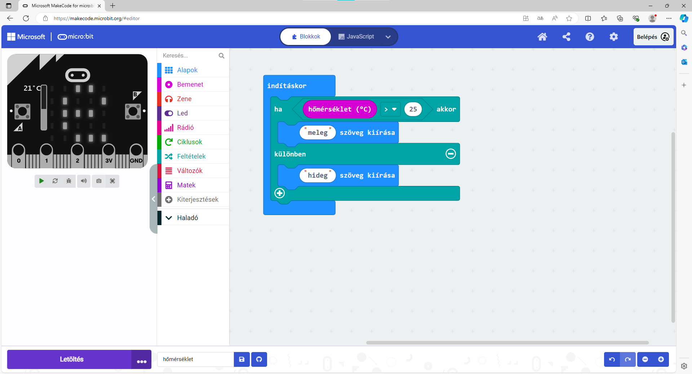

Променљиве вредности
====================

У претходном примеру микробит је извршио различите наредбе у зависности од математичког израза који ће увек имати 
исту вредност. Он ће, у овом случају, сваки пут кад се покрене програм да напише „Netacno“.

Међутим, најчешће се у програму јављају као услов изрази који мењају вредност. Један од једноставнијих примера - 
корисник унесе неки број, па ако је дељив са два програм испише „Paran“, иначе испише „Neparan“. 

**Вредности које уноси корисник су променљиве, па се и оно што исписује микробит мења у зависности од тога.**

.. questionnote::

 Рекли смо да микробит може да мери температуру. Да ли температура има увек исту вредност или се мења?
 
У овом окружењу постоји у групи Улаз блок „температура (степен C)“ који можеш да користиш у свом програму уместо неког 
конкретног броја. У њему се чува тренутна температура и може током извршавања програма да добија различите вредности. 

Погледај на који начин можеш да користиш овај блок…

Пример 8
~~~~~~~~

Састави програм којим ће у зависности од температуре у околини микробита на екрану бити исписано „toplo“ или „hladno“.

Поређај блокове као на слици испод:

	
Микробит је само једном измерио температуру и написао „toplo“ (на симулатору смо померили термометар на 36 степени). 
И то је то… А шта ако се температура у међувремену промени? Где смо погрешили?

Логично је да микробит стално мери температуру и проверава да ли је топло или хладно. 

Који блок онда треба да применимо уместо блока ``почетак``?

Погледај како изгледа исправно састављен програм за овај проблем:

.. image:: ../../_images/mb19.png
	:width: 800
	:align: center

.. questionnote::

 Отвори групу *Улаз* и погледај који још блокови који имају променљиву вредност постоје. 
 На који начин би их искористио у неком од својих програма?

Осим ових већ постојећих блокова за вредности које се мењају (температура, јачина осветљења…), можеш да направиш и 
своје блокове. Да смислиш неки назив за променљиву вредност и да користиш тај блок у свом програму.

Пример 9
~~~~~~~~

Пред тобом је мало другачији задатак од досадашњих. На екрану треба да буде приказан број. Сваки пут када притиснеш 
тастер **А** број треба да се увећа за 2. Када се покрене програм, број треба да буде нула.

Прочитај још једном задатак. Шта, у ствари, треба да урадиш? **Број** треба да буде приказан када се притисне тастер. 
Да ли је број увек исти? Није. **Број** се сваки пут мења, променљив је.

Хајде да онда направимо променљиву Број и да сваки пут када се притисне тастер променимо њену вредност и прикажемо је.

.. questionnote::

 По тексту задатка, колика треба да буде почетна вредност променљиве **Број**? За колико треба сваки пут да је променимо?

Како правиш блок за променљиву вредност?

Кликни на групу Променљиве (1), а затим на Направи променљиву (2). Упиши име променљиве у прозору који се појави. 
Нека се зове **Број**.

	
Погледај слику испод. Међу променљивама се појавила и твоја. Сада можеш у њу да смешташ различите вредности – 
да јој додајеш бројеве, множиш је неким бројем, поредиш… користиш је као блок са било којим другим бројем.

.. image:: ../../_images/mb21.png
	:width: 800
	:align: center	

.. questionnote::

 Из математике сте радили задатке са променљивим вредностима. Којим словима их обично обележавате?
 На које све начине можемо да поредимо променљиве? 

Вратимо се на наш програм. Постави блокове као на слици испод:

.. image:: ../../_images/mb22.png
	:width: 800
	:align: center	
	
Дакле, на почетку извршавања програма број је постављен на нулу. Сваки пут кад се притисне тастер А Број се увећа 
за два и прикаже.

Измени или допуни програм тако да буде приказана и нула на почетку!

Пример 10
~~~~~~~~~

У претходном примеру приметио си и један нови блок из групе Улаз. Он омогућава да се неке наредбе изврше када се 
притисне тастер **А**. На исти начин можеш да програмираш шта треба да се деси када неко притисне тастер **Б** или оба 
тастера истовремено **(А + Б)**.

Микробит може да реагује и на још неке догађаје – када се протресе, када се закрене на неку страну, када удари о 
нешто и слично. Погледај који све блокови постоје у групи Улаз. За овај интересантан пример користићемо блок ``када се протресе``.

.. image:: ../../_images/mb23.png
	:width: 800
	:align: center	

Један од блокова који такође може да има променљиву вредност (``одабери случајну вредност од _ до``) налази се у групи Математика. 
Употребили смо га на следећи начин:

.. image:: ../../_images/mb24.png
	:width: 800
	:align: center

.. questionnote::

 Шта ради овај програм? За шта би могао да употребиш микробит у који је учитан овај програм?