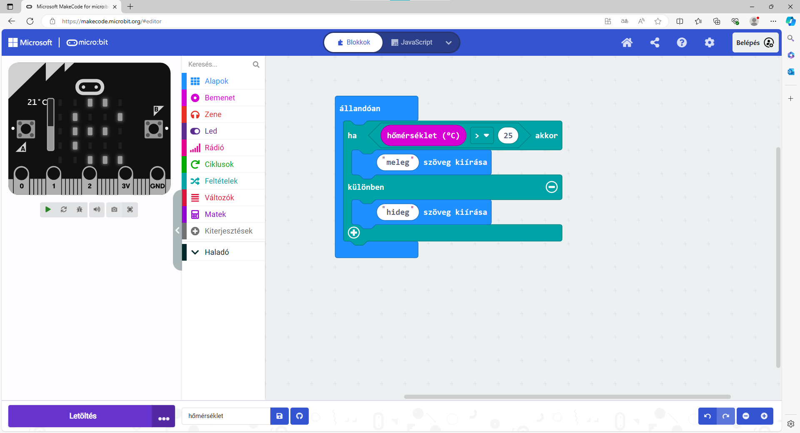
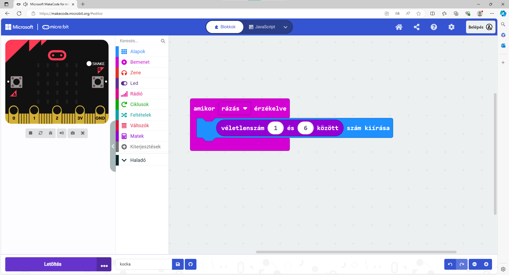

Változó értékek
===============

Az előző példában a microbit különböző parancsokat hajtott végre egy matematikai kifejezés alapján, amely mindig ugyanazt adja eredményül. 
Ebben az esetben a program minden egyes futtatásakor a microbit a „Helytelen“ szót fogja kiírni.

Azonban legtöbb esetben a programban feltételként szereplő kifejezések változó értékűek lehetnek. 
Egy egyszerű példa: a felhasználó beír egy számot, és ha az osztható kettővel, a program a „Páros“ szót írja ki, ellenkező esetben pedig a „Páratlan“ szót.

**A felhasználó által beírt értékek változók, ezért a microbit által kiírt értékek is ennek megfelelően változnak.**

.. questionnote::

 Említettük, hogy a microbit képes megmérni a hőmérsékletet. Vajon a hőmérséklet mindig ugyanaz, vagy változik?
 
Ebben a programozói környezetben a *Bemenet* csoportban egy „hőmérséklet (°C)“ blokk is található, amelyet felhasználhatsz a programodban is egy konkrét szám helyett. 
Ebben a blokkban a pillanatnyi hőmérséklet tárolódik, ami a program futása során különböző értékeket vehet fel.

Nézzük meg, hogyan használhatod ezt a blokkot!

8. példa
~~~~~~~~

Készíts egy programot, amely a microbit környezetének hőmérsékletétől függően a képernyőn „meleg” vagy „hideg” szót jelenít meg!

Rendezd el a blokkokat az alábbi képen látható módon:

.. image:: ../../_images/mb18.png
	:width: 800
	:align: center
	
A microbit csak egyszer mérte meg a hőmérsékletet, és kiírta, hogy „meleg” (a szimulátoron a hőmérőt 36 fokra állítottuk).
Mindössze ennyi... De mi van, ha időközben megváltozik a hőmérséklet? Hol hibáztunk?

Logikus, hogy a microbitnek folyamatosan kellene, hogy mérje a hőmérsékletet, és ellenőriznie kéne, hogy meleg vagy hideg van-e.

Milyen blokkot kellene alkalmaznunk az ``indításkor`` blokk helyett?

Nézd meg, hogyan néz ki az a program, amely megoldja ezt a problémát:

.. questionnote::

 Nyisd meg a *Bemenet* csoportot, és nézd meg, milyen egyéb blokkok vannak, amelyek változó értékkel rendelkeznek!
 Hogyan tudnád felhasználni ezeket valamelyik programodban? 

A meglévő blokkokon kívül, amelyek változó értékeket használnak (hőmérséklet, fényerősség, stb.), saját blokkokat is készíthetsz.
Kitalálhatsz egy nevet a változó értékhez, és használhatod ezt a blokkot a programodban.

9. példa
~~~~~~~~

Ez a feladat egy kissé eltér az eddigiektől. A képernyőn egy számnak kell megjelennie. Minden alkalommal, amikor megnyomod az **A** gombot, a számnak 2-vel kell növekednie. A program elindulásakor a számnak nullának kell lennie.

Olvasd el még egyszer a feladatot! Mit is kell valójában tenned? A **számnak** meg kell jelennie, amikor megnyomod a gombot.
A szám mindig ugyanaz? Nem. A **szám** minden alkalommal változik, vagyis egy változó.

Hozzunk létre egy *Szám* nevű változót, és minden alkalommal, amikor megnyomod a gombot, változtassuk meg az értékét, majd jelenítsük meg!

.. questionnote::

 A feladat szövege alapján mivel egyenlő a **Szám** változó kezdőértéke? Mennyivel kell minden alkalommal változtatni az értékét?

Hogyan hozzunk létre egy blokkot a változó értékhez?

Kattints a Változók (1) csoportra, majd a Változó létrehozása... (2) gombra! Írd be a változó nevét a megjelenő ablakba!
Legyen a neve **Szám**!

.. image:: ../../_images/mb20.png
	:width: 800
	:align: center	
	
Nézd meg az alábbi képet! A változók között megjelent a saját változód is. Mostantól különböző értékeket tárolhatsz benne – 
hozzáadhatsz számokat, megszorozhatod egy számmal, összehasonlíthatod, stb., vagy használhatod, mint egy blokkot bármely más számmal.

.. image:: ../../_images/mb21.png
	:width: 800
	:align: center	

.. questionnote::

 
 Matematikaórán változó értékekkel kapcsolatos feladatokat is oldottatok már meg. Általában milyen betűkkel jelöltétek őket?
 Milyen módokon hasonlíthatjuk össze a változókat?

Térjünk vissza a feladathoz! Állítsd össze a programot alkotó blokkokat az alábbi kép alapján:

.. image:: ../../_images/mb22.png
	:width: 800
	:align: center	
	
Tehát a program elején a szám nullára van állítva. Minden alkalommal, amikor megnyomod az A gombot, 
a Szám kettővel növekszik, és megjelenik a kijelzőn.

Módosítsd vagy egészítsd ki a programot úgy, hogy a kezdeti nulla értéket is megjelenítse!

10. példa
~~~~~~~~~

Az előző példában felfigyelhettél egy új blokkra a Bemenet csoportból. Ez lehetővé teszi, hogy bizonyos parancsok végrehajtódjanak, amikor megnyomjuk az **A** gombot. Ugyanígy beprogramozhatod, hogy mi legyen, ha megnyomjuk a **B** gombot, vagy esetleg mindkét gombot egyszerre **(A + B)**.

A microbit más eseményekre is reagálhat – például amikor megrázzák, amikor egy adott irányba fordítják, amikor megütik valamivel, és hasonlók. 
Nézd meg, milyen blokkok találhatók még a Bemenet csoportban! Ehhez az érdekes példához használjuk fel az ``amikor rázás érzékelve`` blokkot.

.. image:: ../../_images/mb23.png
	:width: 800
	:align: center	

Az egyik blokk, amely szintén rendelkezhet változó értékkel (``véletlenszám _ és _ között``) a Matek csoportban található.
A következő módon használtuk fel az alábbi programban:

.. questionnote::

 Mit csinál ez a program? Mire használhatnád azt a microbitet, amelyikben ez a program fut?
